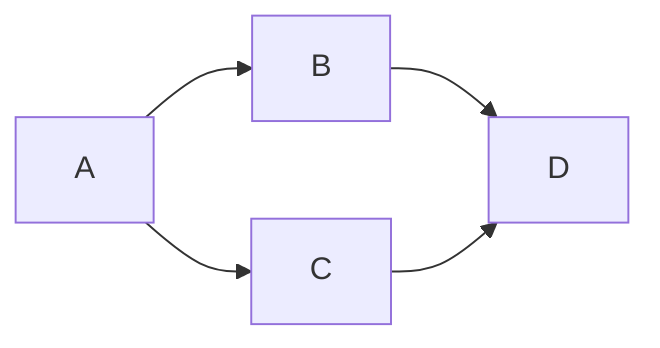

### 09:13 Woke Up  

Today, I integrated Mermaid's flowchart into my blog, and it also displays correctly in Obsidian.  

Testing the cover page a bit more—this will allow me to create richer content in the future.  

### 20:40 Back from a Walk with Mom  

Took Mom around the area where I live, passing by my brother’s workplace, and then walked her back home.  

A few more trips like this, and I’ll get familiar and comfortable with the route.  

### 21:52 Fixed the Missing 404 Page Issue  

Placed a default `404.html` page directly in the `static` folder to address the missing 404 page issue across multiple sites. Additionally, I implemented automatic language switching (Chinese/English) via script based on path matching.  

As long as it works, it’s good enough.  

### 22:25 Taking a Shower and Getting Ready for Bed  

Indeed, getting proper sleep makes a huge difference—I feel so much more energetic now.

Today I slept in quite a bit longer, and my health bar slowly refilled.  
