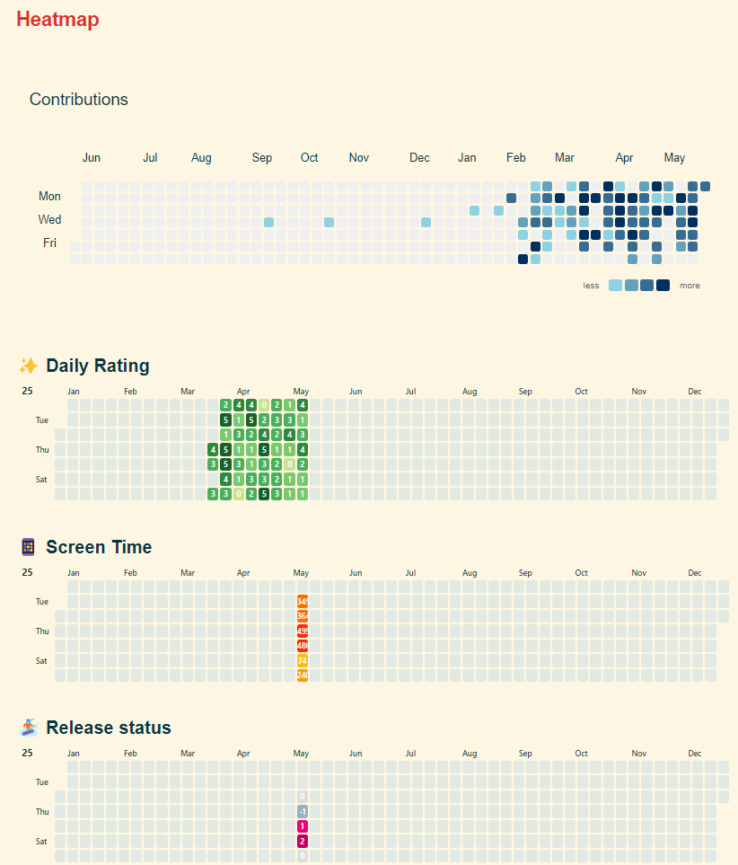

早上我妈打电话来说叫我明天早上去体育中心那边吃炖大鹅，我很不想去，电话那头我二姨妈，我莲姐叨叨叨地说个不停，实在没办法拒绝了。

赶紧起床煮了碗面条分小欢欢吃，然后我准备准备明天资格复审的材料，欢欢帮我把碗筷洗了，收拾得整整齐齐。

时间就已经来到中午了，我俩一同出门坐一趟车，她去考试，我去体育中心那边。

去到亲戚家总是很热情，吃了很多好吃的，时间差不多就回来了。

水城的公交是真 tm 的离谱，师傅从来不会多等一秒钟，连有腿脚不方便的人下车都不会多等。下次再有人和司机吵起来，我也不会再有那种同情司机的想法了。

回来后躺着休息了半个小时，然后出门去打印资格复审的材料，顺便去快递站拿欢欢给我买的剃须刀。

一天就这样又过去了。

### 21:48 又表现地非常没有耐心

晚上妈妈给我打视频说，她的手机打不进来，也打不出去。

我想着叫她用 QQ 分享屏幕，我看看是啥情况。结果登录 QQ 这个过程就彻底难倒她了，我怎么教也教不会，整个过程就每句话都很没有耐心的和她说。

最后实在不行我放弃了，我尝试打电话过去，发现又能够打得通，她也能够正常拨回来。然后他说我老爸的打不通，我预期特别不耐烦地说：你打回去试试嘛！

然后应该是可以了，但是妈妈没有再打电话过来。心里还是挺内疚的，已经比较晚了，明天我再给她打个电话问下吧。

> [!tip]+ 经验
> 1. 以后给老爸老妈下载个腾讯会议可能会方便一点
> 2. 如果条件允许，马上验证错误是很重要的第一步
> 3. 还是要提高沟通技巧和锻炼自己的心态，少伤害别人

### 22:55 优化了下heatmap

解决了 intensity 为 0 时不显示的问题，字体重设为 `size=7px, weight=500`。

现在感觉已经非常美观了，希望能够坚持把所有格子填满。

