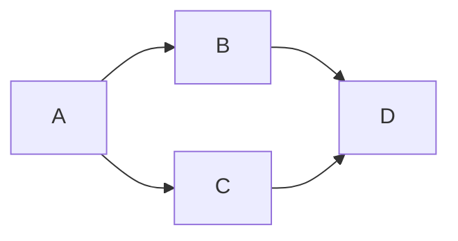

### 09:13 起床

今天将 mermaid 的流程图整合到了博客上，同时在 Obsidian 里面也能够正常显示。

再测试测试封面，以后可以创作出更多丰富的内容。

### 20:40 和妈妈散步回来

带着妈妈往我住的这个地方绕了一圈，绕到哥哥上班的地方，最后送她回去。

多走两遍就熟悉和习惯了。

### 21:52 修复了 404 页面缺失的问题

在 static 里面直接放了一个默认的 `404.html` 页面，用以弥补多站点 404 页面缺失的问题。另外还通过 script 实现了中英文的自动切换，是根据路径匹配的。

能用就行了。

### 22:25 洗个澡准备睡觉了

果然睡好觉之后，整个人都有活力许多。

今天多睡了好一会儿，血条又慢慢回满了。
