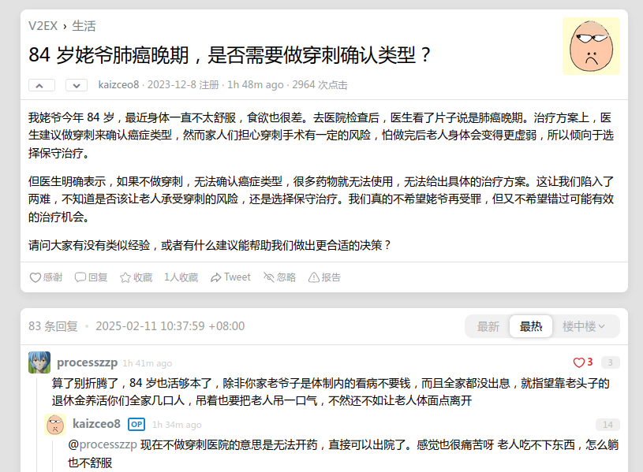

### 10:17 写完了一支笔

今天天气很好！好久没在水城见到这么大的太阳了。

人的奇妙的正反馈或者说成就感，有时候总是来源于一些莫名其妙的东西。比如刚刚我写完了一只笔，我会突然觉得有种快乐和幸福。

### 15:13 跑腿送材料回来

上图是我看到的一个帖子和讨论，如何面对死亡和亲人的死亡是一个课题。能够预知自己的死亡也是一件好事，能够让我们放弃幻想，认清形势！

### 17:03 做题做累了

> 人的精力是有限的。

这句话里面提到的精力应该是可以分为两部分——注意力和身体状态。进化而来的注意力总是会集中在新鲜事务或者突然出现的事务中，长时间连续面对同一个事务就必定会导致注意力涣散。但注意力涣散是一件相当重要的事情，唯有注意力涣散时精神才能放松。

而另一部分身体状态则很容易理解，身体长时间地在非舒适状态保持静止或者运动，会引起机体疲劳甚至受损。

于是一些不起眼就显得格外重要，尤其是对于一些工作狂或者运动狂热爱好者来说。比如喝水、拉屎、打盹、远眺、伸懒腰之类的事情。

### 21:41 吃完很好吃的炒饭

下班回来把之前剩下的米给煮了，然后把Navi页面的显示逻辑bug给修复了。刚刚吃完香喷喷的炒饭，简单亦是幸福。今天中午还和欢欢说，我最喜欢吃食堂了。主要有两个原因，一是不用去做吃啥的决定；二是还能省钱。

折腾代码可费时间了，要减少自己的强迫症。不过有一点好处就是，讲Obsidian作为Hugo的编辑器，而且能够很方便同步之后，创作的欲望就变得很强，什么东西都想记录下来。

欢欢今晚健身回来，没吃晚饭，不好。准备刷题学习了

### 23:23 和小欢欢刷完牙

Push、关机、准备睡觉！

### 今日待办

- [x] 修复移动端默认展开，整合代码
- [ ] 给刘老师发邮件，请求相关资源