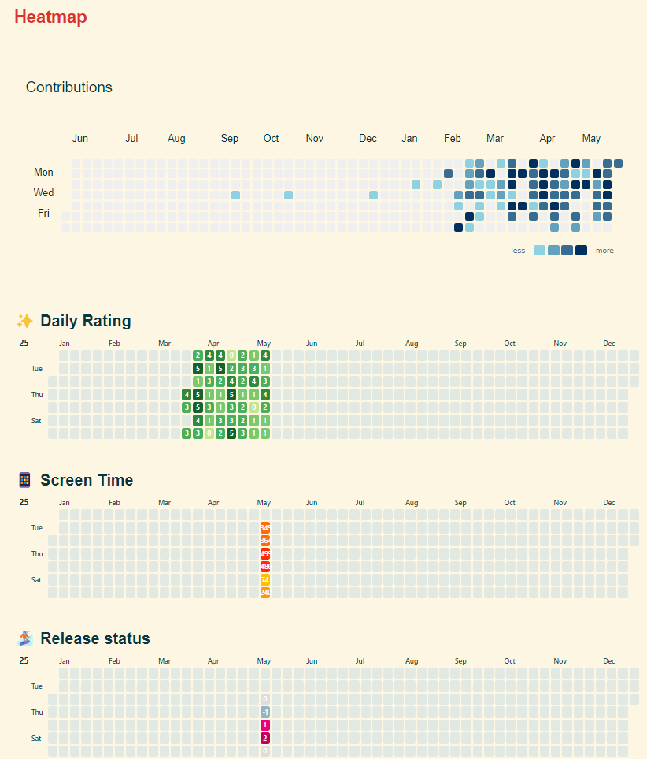

This morning, my mom called and told me to go to the sports center tomorrow morning to eat stewed goose. I really didn’t want to go, but my second aunt and my sister Lian kept nagging nonstop on the other end of the line, making it impossible to refuse.

I quickly got up, cooked a bowl of noodles, and shared some with Xiaohuanhuan. Then, I prepared the materials for tomorrow’s qualification review while Huanhuan helped me wash the dishes and tidy up neatly.

Before I knew it, it was already noon. We left the house together and took the same bus—she went for an exam, and I headed to the sports center.

Relatives are always so hospitable. I ate a lot of delicious food, and when it was about time, I came back.

The buses in Shuicheng are absolutely ridiculous. The drivers never wait an extra second, not even for someone with mobility issues getting off. Next time someone argues with the driver, I won’t feel any sympathy for them.

After returning, I lay down and rested for half an hour, then went out to print the materials for the qualification review and stopped by the courier station to pick up the razor Huanhuan bought for me.

And just like that, another day passed.

### 21:48 — Acting Very Impatient Again  

Tonight, my mom video-called me and said her phone couldn’t make or receive calls.  

I thought of asking her to use QQ’s screen-sharing feature so I could see what was going on. But the process of logging into QQ completely stumped her. No matter how I tried to guide her, she couldn’t get it, and I ended up speaking to her very impatiently the whole time.  

Eventually, I gave up. I tried calling her and found that the call went through, and she could call back normally. Then she said my dad’s phone wasn’t working. With extreme impatience, I snapped, “Just try calling back!”  

It probably worked, but my mom didn’t call again. I felt pretty guilty. Since it was already late, I’ll call her tomorrow to check in.  

> [!tip]+ Lessons Learned  
> 1. In the future, it might be easier to download Tencent Meeting for my parents.  
> 2. If possible, verifying the issue immediately is a crucial first step.  
> 3. I still need to improve my communication skills and work on my mindset—less hurting others.  

### 22:55 — Optimized the Heatmap  

Fixed the issue where intensity=0 wouldn’t display and reset the font to `size=7px, weight=500`.  

Now it looks very aesthetically pleasing. I hope I can keep filling in all the squares.

  

**Heatmap of My Recent Life**  

Recently, I've been trying to visualize my daily routines and habits using a heatmap. This chart clearly shows the distribution of my time and energy over the past few weeks.  

The red areas indicate high-intensity activities, such as work and study sessions, while the blue parts represent relaxation or leisure time. I noticed that my productivity peaks in the morning, gradually declining in the afternoon and evening. There are also some blank spots—those are probably days when I was too lazy to record anything.  

Looking at this heatmap, I realize I need to better balance work and rest. Maybe I should schedule more breaks or adjust my tasks to match my natural energy fluctuations.  

How do you track your daily activities? Do you also use visualization tools? Feel free to share your methods!

