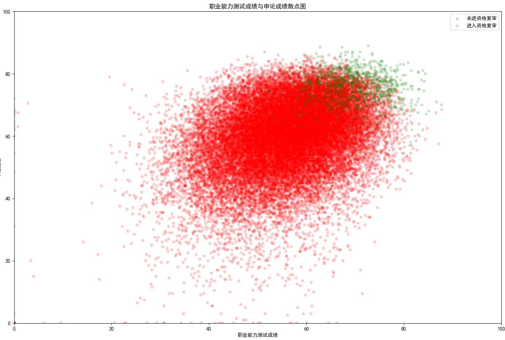

很久没有早早起床了，因为上午去参加物资保障中心的面试。

严格来说，这是我第二次参加结构化面试。第一次是还没毕业的时候，参加安顺的选调。那次都没有好好准备，就看了点视频熟悉了下面试流程。没有准备的结果自然就是落选了，不过笔试裸考直接进面还是挺意外的。

这次想着还是好好准备一下，如果不好好准备还不如不去呢。于是叫欢欢帮我练习了两个晚上，自己也简单的练了一会儿。牛蛙特别耐心和贴心的给我说着各种面试的细节和注意事项，说得我都有点烦了哈哈，不过心里还是特别感谢她。

今天出门也是慌慌张张，导致身份证忘记了带。然后工作人员特别严谨地检查了我 12306 和支付宝相应的身份信息，没让我回去拿或者拒绝我参加考试。

检查完毕在候考室坐定后，面试本能的紧张就来了。和候考室的工作人员简单闲聊了一会儿后，放松了些。

抽签我最后一个抽，已经谈不上抽了。刚好是 3 号，最近在 B 站总看到一个培训面试的，发一些模仿紧张考生的搞笑视频。视频里面总是以 3 号举例子，抽到这个我直接笑了。

然后就是面试，相比第一次，我放松了许多，各种表现都很自然。考官依旧很多，小小的房间坐满了十来个人，聚光灯下。

题目一共有三个，时间15 分钟，分别是：1. 习语；2. 自然灾害的应急处置；3. 科员不愿意履行应急值班义务。第一类的题目我没有正经的练习过，只能想到什么就说什么，大概说了人生价值、家国情怀之类的；第二个和欢欢练习的时候有类似的，所以就比较熟悉；第三个也是本着以人为本的原则去了解，以身作则的去劝说。

面试完在候分室里面等了好久，时间在这里慢了下来，因为啥都不给做。不给交流不给看书玩手机。不知道等了多久，或者是他们讨论了怎么评分吧，说了很久。

终于开始叫我们过去听分，很快就到我了。最终得分：85.8 分，我自己对这个分数还挺满意的，不出意外的话应该是第一。

-----

之前参加交通厅的考试，成绩也出来了，不出意外是 5 万多人中陪跑的一个（行政职业能力测试：55.9，申论：69.5，同岗位 26 名）。行测不经过大量练习，考试有限时间内面对大量题目还是力不从心。

