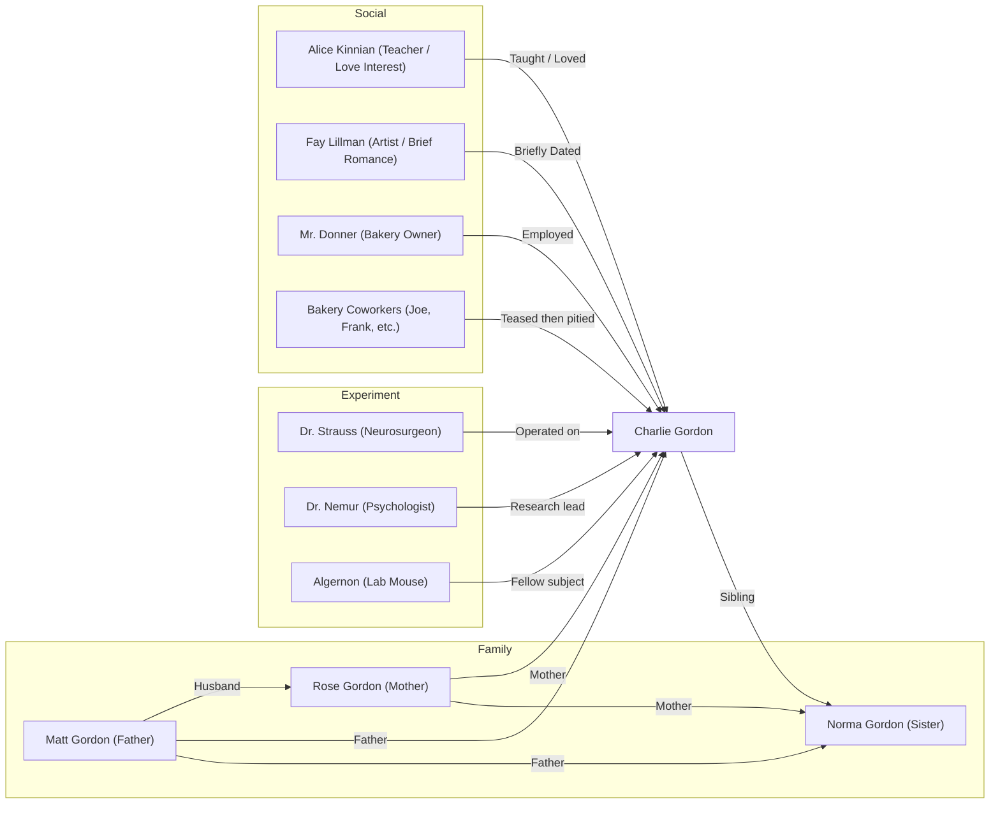

**Dear Huanhuan,**

*"If you were Charlie, would you choose to undergo the surgery?"* you asked in your last letter.  

At the time, my answer was no—ignorance is bliss. But after reading most of the book, I’ve begun to reconsider—this time, through the lens of love.  

In the first half of *Flowers for Algernon*, I had always believed that Charlie’s mother, Rose, was the only person in the world who truly cared for and loved him. I even mistook his father Matt’s calm demeanor for indifference. When everyone else had given up hope that Charlie could ever become "normal," I was moved by Rose’s relentless determination—whether she was scolding Charlie, pleading with doctors, or arguing with Matt.  

But everything changed with Norma’s arrival. It became clear that Rose’s persistence wasn’t about Charlie’s well-being; it was about proving to others that her child wasn’t an idiot—or that she wasn’t the reason for his condition.  

The more she tried to prove herself, the more desperate she appeared, the more she clung to the hope of Charlie becoming "smart"—all of which only revealed her subconscious disdain for him. This subconscious rejection ultimately manifested in her threatening Matt with a knife, forcing him to take Charlie away that very night.  

In contrast, Matt’s attitude was far more rational and genuine. He believed Charlie had the right to live his own life, even if it was the life of a "simpleton." He was more concerned with his own survival, with the things he despised and the things he desired. His lack of obsession, his refusal to force anything—that was his way of respecting Charlie.  

Now, back to your question: *Would we choose the surgery?* I think, more often than not, if we were in Charlie’s shoes, we wouldn’t actually have the luxury of choosing the life we want.  

What I’ve been pondering instead is: *What if we were Rose? Or Matt? Or Norma? Or even Alice?* What would we do? That feels more realistic, more practically meaningful for the future. After all, we’re bound to encounter people like Charlie—strangers, neighbors, relatives, children, even friends. *Would they be friends?*  

Could the people in the book be someone we know in real life? If we were Charlie, would we resent them? Would Norma resent her parents? Probably not.  

Recognizing true love is difficult. Most of the time, we’re just Charlie wetting his pants, not the Charlie with superhuman intelligence.  

Maybe not recognizing it is the better choice—just like refusing the surgery might be.  

Love,  
Zhuzhu  
April 14, 2025  

---  
**P.S.** Character relationship chart:  

