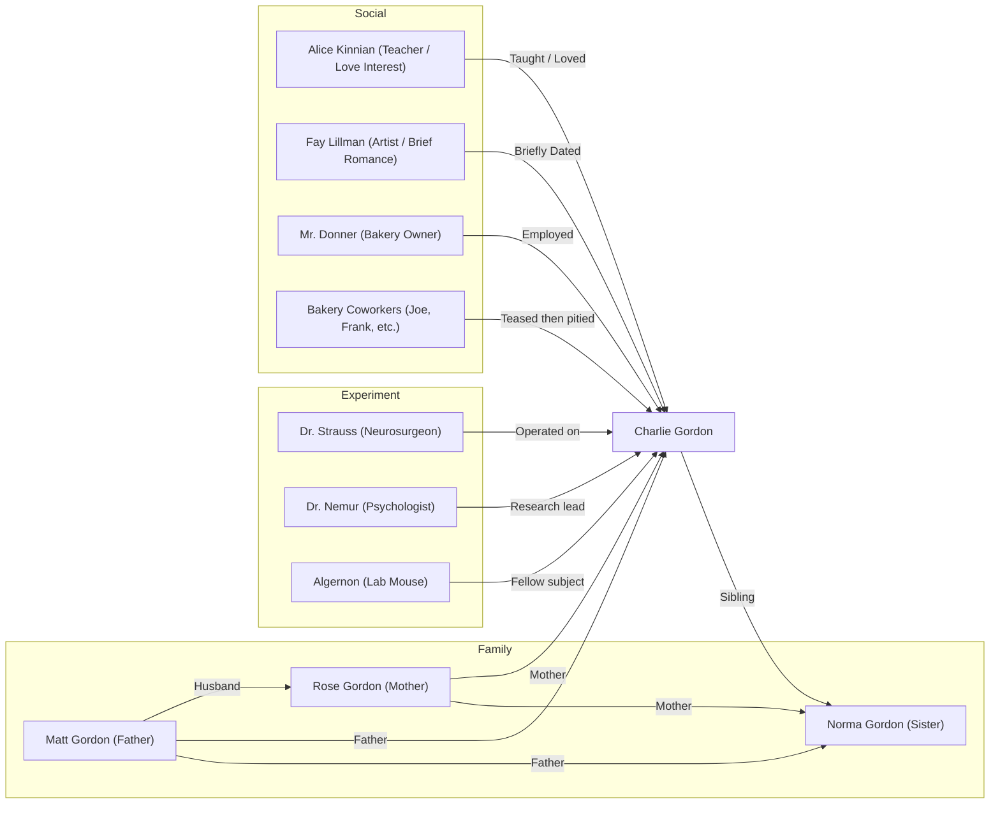

亲爱的欢欢：

“如果你是查理，你会愿意接受手术吗？”你上一封信问我道。

我当时的回答是，不会，傻人有傻福。但在阅读了大半这本书之后，我开始有其他的一些思考——关于爱。

在 *《Flowers for Algernon》* 的前半部分，我一直以为 Charlie 的妈妈 Rose 是这个世界上唯一在乎和爱 Charlie 的人；一度以为他父亲 Matt 所展现出来的冷静是冷漠的外在表现。在所有人都对 Charlie 变为正常人不报任何希望时，我甚至还为 Rose 所展现出来的执着所感动。在她喝斥 Charlie 时、在她哀求医生时、在她和 Matt 争执时……

一切的变化都只是由于 Norma 的出现，才明白 Rose 的执着只是想证明给别人看自己，自己的孩子不是呆子，或者说自己并不是造就这一切的原因。

可她越想证明，越表现的执着，越表现自己 Charlie 变聪明的那种渴望，恰恰印证了潜意识里自己对 Charlie 的嫌弃。这一潜意识最终也表露为拿起刀威胁 Matt 连夜将 Charlie 带走的这一转变。

转过来看 Matt 的态度，至少比 Rose 理性和真实许多，他想 Charlie 有权利有自己的人生，哪怕只是傻子的人生。他更关注自身的生存状况，有着自己厌恶的和想要做的事情。不执着、不强迫的这种态度也正是能够给到 Charlie 尊重的一种方式。

再回到你信里面所问的我们是否要选择动手术？我想说的是，更多的时候，如果我们身处 Charlie 的处境，我们是无法选择我们想要的生活的。

我更多想的是，如果我们是 Rose？是 Matt？是 Norma？抑或是 Alice？我们会做些什么？这更贴合实际，也更对未来具有实践意义。毕竟我们总是免不了会接触到类似 Charlie 这类人，可能他是陌生人、邻居、亲戚、孩子，甚至是朋友，会是朋友吗？

书中的每一个人会是我们身边的某个人吗？如果我们是 Charlie，我们会憎恨他们吗？Norma 会憎恨她的父母吗？应该不会吧。

认清真实的爱是一件困难的事情。更多的时候我们都只是会尿裤子的 Charlie，而不是拥有超高智商的 Charlie。

或许不认清也是较好的选择，如同不选择手术也是。

爱你的朱朱  
2025 年4 月14 日

-------
附人物关系图：

