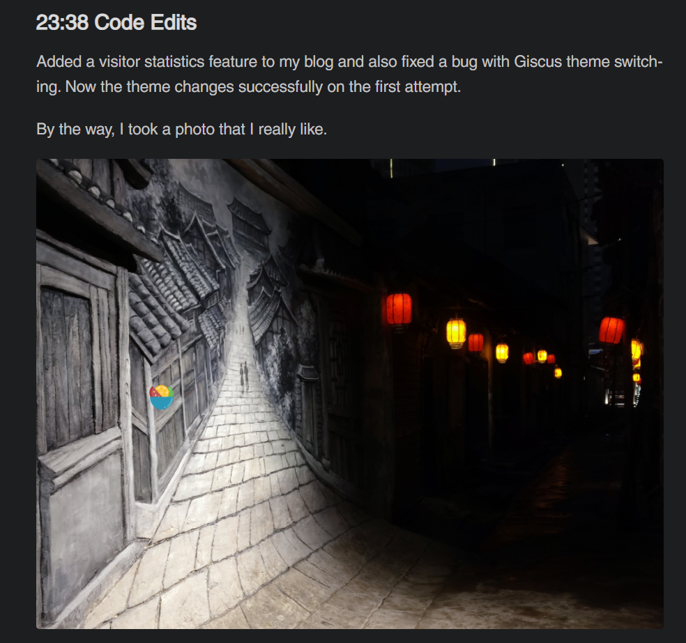

## Problem

When managing images for a Hugo blog in Obsidian, using an image hosting service can be unstable. Without one, inserting images becomes difficult and maintenance is cumbersome. Common issues include:

1. **Path Confusion**: Manual maintenance of the `/static/images` directory structure is required.
2. **Multi-language Adaptation**: Duplicate configuration is needed for Chinese and English paths.
3. **Poor Development Experience**: Frequent 404 errors occur during local debugging and file operations.

## Demonstration

Direct rendering may result in errors due to incorrect paths, as shown below:

```bash
GET http://192.168.3.29:1313/en/static/images/diary/two-ways.png 404 (Not Found)
```

After applying the script, the image path is corrected and re-requested:

```bash
Replaced: http://192.168.3.29:1313/en/static/images/diary/two-ways.png -> http://192.168.3.29:1313/images/diary/two-ways.png
```

The image is then rendered correctly.



## Solution

This section provides a conceptual reference. Anyone can easily implement it. If you need the source code, feel free to request it in the comments.

```js
// instead_images.js
const IMAGE_REWRITER_CONFIG = {
  pathPatterns: [
    {
      test: /(\/zh|\/en)\/static\/images\/(.*)/,
      replace: '/images/$2'
    }
  ],
  debug: true
};

function rewriteImageSource(src) {
  // Implement smart path conversion
  // [Core logic code...]
}

// Hijack the native image creation method
document.createElement = function(tagName) {
  // [Image object hijacking code...]
}

// Dynamic content handling
new MutationObserver(() => {
  // [Auto-processing for new images code...]
});
```

## Configuration

### Configure Hugo

In `config.yaml`, set:

```yml
params:
  InsteadPicture: true
```

Then, simply include the following in the head section:

```go
{{- if .Site.Params.InsteadPicture -}}
<script src="{{ "/js/instead_images.js" | relURL }}"></script>
{{- end -}}
```

After configuring Obsidian, the solution will take effect.

### Configure Obsidian

1. Set file references to use **relative path** mode.
2. Configure the image storage directory as needed. For example, mine is `static\images\`.
3. No need to worry about file changes—Obsidian automatically updates links when files are moved.

## Advantages

1. **No Dependency on Image Hosting**: All images are managed locally without any file operations.
2. **Developer-Friendly**: Real-time reloading doesn’t disrupt the writing flow.
3. **SEO Optimization**: Ensures consistency in static resource paths.
4. **Multi-platform Compatibility**: Works seamlessly with static site generators like Hugo/Hexo.
5. **Easy Organization**: Moving file paths can rely on Obsidian to automatically update links.
