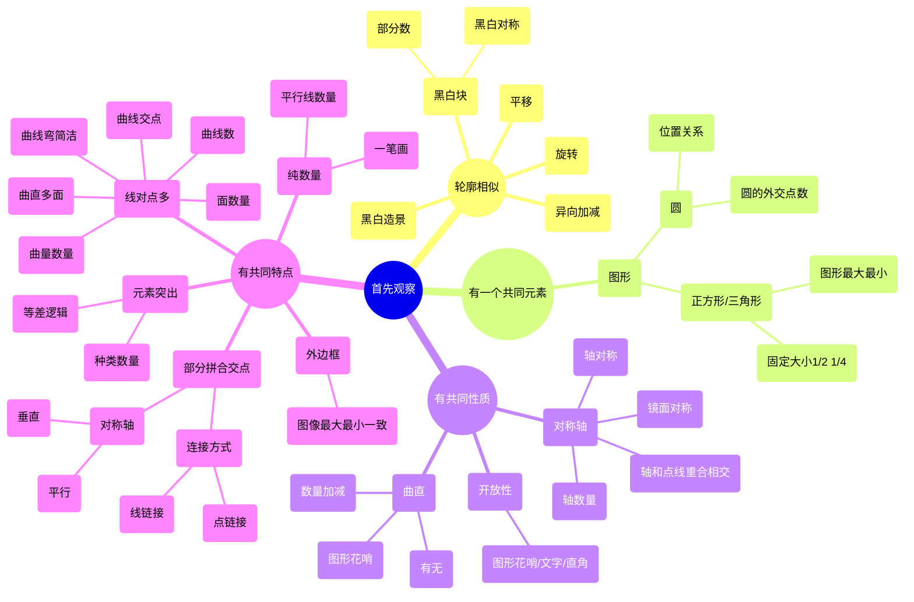

> **行测不要求稳，要有拼搏精神，以弱者的心态拼搏**
> 公考正道是沧桑

## 注意事项

1. 只剩下 15 分钟的时候，没做完的题目先涂答题卡，全选 D，然后有时间再做一个改一个
2. 

## 结构相似

## 判断推理

### 图形推理
#### 平面图推

视频教程：[图形推理之六面体《行测》进阶课——正道沧桑_哔哩哔哩_bilibili](https://www.bilibili.com/video/BV1vS4y1p7ea/)
#### 六面体——定、寻、马、挂
1. **定**：确定基准面（非中心对称、非重复、正面优先）
2. **寻**：寻找相邻面，定第二面（寻不到就马，马到二面回马枪）
3. **马**：马走日找共点（简单的直角）
4. **挂**🌟：以点挂第三面，定三面（只挂一面、旋转贴合确认）
##### 怎么判断共点
给立方体和展开图标点号，寻找对应关 
1. 直角
    1. 直角两边相邻的点的共点
    2. 直角两边相邻（必须一延申、一垂直）的等距延申边也共点
2. 马走日
    1. 马走日两次的点也一定共点

P.S
- 六个面一样直接放弃（在 A、D 之间选择），此时<mark style="background: #FFF3A3A6;">放弃是性价比最高的选择</mark>。

### 加强削弱

有以下假设：
1. 要看到命题人同样的风景
2. 考点是固定的，很难有新的考点
3. 不要发散，注重题目形式和内容

论证的基本结构:
1. 线性结构（使前提假设更加完备）
    P₁ → P₂ → C
2. 组合式（缺一不可）
    P₁ + P₂ → C
3. 收敛式（有了更好，没有也行）
    P₁
    P₂
    → C
4. 发散式
    P₁
    → C₁
    → C₂
    
    P: 前提、假设
    C: 结论

## 数量关系

> [!todo]
> 时间充分再学，先提升其他部分

## 资料分析
### 增长量计算
现期量 $A$，增长率 $a$；基期量 $A^{\prime}$ ，增长量 $\Delta A$。
##### 百化分
| 百分比 | 分数表示 | 百分比 | 分数表示 |
|--------|----------|--------|----------|
| 50%    | 1/2      | 9.1%   | 1/11     |
| 33%    | 1/3      | 8.3%   | 1/12     |
| 25%    | 1/4      | 7.7%   | 1/13     |
| 20%    | 1/5      | 7.1%   | 1/14     |
| 16.7%  | 1/6      | 6.7%   | 1/15     |
| 14.3%  | 1/7      | 6.3%   | 1/16     |
| 12.5%  | 1/8      | 5.9%   | 1/17     |
| 11.1%  | 1/9      | 5.6%   | 1/18     |
| 10%    | 1/10     | 5.3%   | 1/19     |

e.g. 8%求增长量的时候，化为 12.5，加上基期量 1，为 13.5。
通过把增量看作整体的且非 1 的概念，可以得到更普适的百化分

当一个百分比的增速被化作分数后，如 $\frac{n}{m}$，其内涵是基期量是 $m$ 份，增量是 $n$ 份，故现期量是 $m+n$ 份。而题目给的是现期量 $A \times \frac{n}{m+n}$ 就是增量。而 $n=1$ 是其中的一种而已。

当增长率小于 0，即 $A \times \frac{n}{m-n}$，原理是一样的。同学们自行画图理解。

在应用中，最常用是：
- $22.2\% \approx \frac{2}{9}$
- $28.6\% \approx \frac{2}{7}$
- $37.5\% \approx \frac{3}{8}$
- $40\% \approx \frac{2}{5}$
- $42.8\% \approx \frac{3}{7}$

配合：
- $20\% \approx \frac{1}{5}$
- $25\% \approx \frac{1}{4}$
- $30\% \approx \frac{1}{3.3}$
- $33\% \approx \frac{1}{3}$

将 $45\%$ 以内的分数分隔开，配合修正法微调即可。

选项十分接近则假设法；增长率小于 $5\%$ 或大于 $45\%$ 则直接算。

##### 假设法
<mark style="background: #FF5582A6;">选项非常接近</mark>则考虑假设法，避免大量精确计算。

**例题2-1**：2023年A市建筑业总产值为6475.5万元，同比增长8.1%，求2023年A市建筑业总产值增长量？  
A. 471  B. 477  <mark style="background: #FFF3A3A6;">C. 485 </mark> D. 487

解题步骤：
1. 假设增量 475.5
2. 则假设基期为 6000
3. 假设计算增量则为 6000 x 8.1%=486
4. 实际值在假设值和计算值之间（增减量为负时相反），且靠近计算值

**例题 2-3**：2023 年 A 市建筑业总产值为 6475.5 万元，同比增长 28.1%，求 2023 年 A 市建筑业总产值增长量？

A. 1410 <mark style="background: #BBFABBA6;"> B. 1420</mark>  C. 1470  D. 1480

解题步骤：
1. 假设 1475.5
2. 假设基期 5000
3. 假设增量 5000 x 28.1%=1405
4. 修正量为 $({1475-1405}){\frac {28}{128}}=14$
5. 真实为 1405+14=1419

##### 直接算
1. 当增长率小于 5%时，$A \frac {a}{1+a} \approx A(1-a)$,可利用平方差证明
2. 如 $6475.3 \div (1+2.3\%) \approx 6475.3 \times (1-2.3\%)$
3. 不要直接计算，而是看 1%是多少，上例中是 65，2.3 倍则约为 150。
4. 比较小也可用假设基期计算
5. 注意等比例缩放来优选选项，比而不算
6. a 比较大也直接算，比而不算
7. 盯紧某个数，凑 1

##### 假设分配法（拆分后直接算）
本质为构造 “1”，看谁是谁的几倍

**例题 3-5**：2023 年 A 市建筑业总产值为 6480 万元，同比增长 8.1%，求 2023 年 A 市建筑业总产值增长量？

A. 378
B. 485
C. 543
D. 621

PS:
1. 两位数乘法：前前后后、里里外外[两位数乘法的速算 and 十几的平方怎么记忆？_哔哩哔哩_bilibili](https://www.bilibili.com/video/av999371489/)

##### 理论总结
1. 养成看选项的习惯
2. 选项差距极小，直除排除，合理假设
3. 差距一般（<10%），直接算
4. 5<20，百化分加修正
5. 20<40，高级百化分，7，9 非常好用
6. >45，直接算
