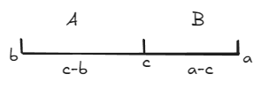
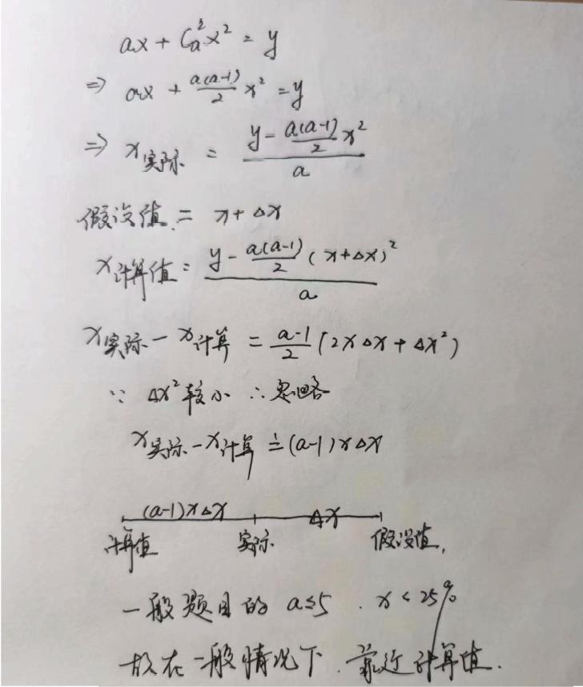

分析数据和选项来选择计算方法，达到高效的原则。

> [!tip]+ 做题习惯
> 1. 先看时间、基期、现期
> 2. 看算什么
> 3. 审题，看选项的精度、选项之间的差距等
> 4. 根据选项和题目数据选定方法
> 5. 列式（直接在题目上写）
> 6. 分析式子，尽量不多算，尽量不算

## 1 增长量计算

> 现期量 $A$，增长率 $a$；基期量 $A^{\prime}$ ，增长量 $\Delta A$。


### 百化分

| 百分比   | 分数表示 | 百分比  | 分数表示 |
| ----- | ---- | ---- | ---- |
| 50%   | 1/2  | 9.1% | 1/11 |
| 33%   | 1/3  | 8.3% | 1/12 |
| 25%   | 1/4  | 7.7% | 1/13 |
| 20%   | 1/5  | 7.1% | 1/14 |
| 16.7% | 1/6  | 6.7% | 1/15 |
| 14.3% | 1/7  | 6.3% | 1/16 |
| 12.5% | 1/8  | 5.9% | 1/17 |
| 11.1% | 1/9  | 5.6% | 1/18 |
| 10%   | 1/10 | 5.3% | 1/19 |
|       |      |      |      |

> [!tip]
> 8 到 12.5 之间的分数，百化分的值直接用 20 来减。

> [!question]-
>  e.g. 8%求增长量的时候，化为 12.5，加上基期量 1，为 13.5。
> 通过把增量看作整体的且非 1 的概念，可以得到更普适的百化分
> 
> 
> 当一个百分比的增速被化作分数后，如 $\frac{n}{m}$，其内涵是基期量是 $m$ 份，增量是 $n$ 份，故现期量是 $m+n$ 份。而题目给的是现期量 $A \times \frac{n}{m+n}$ 就是增量。而 $n=1$ 是其中的一种而已。
> 
> 当增长率小于 0，即 $A \times \frac{n}{m-n}$，原理是一样的。同学们自行画图理解。


高级百化分，在应用中，最常用是：
$$
\begin{array}{rcl}
22.2\% & \approx & \dfrac{2}{9} \\
28.6\% & \approx & \dfrac{2}{7} \\
37.5\% & \approx & \dfrac{3}{8} \\
40\%    & \approx & \dfrac{2}{5} \\
42.8\% & \approx & \dfrac{3}{7}
\end{array}\xLeftrightarrow[配合修正法微调]{将 45\% 以内的分数分隔开}
\begin{array}{rcl}
20\%   & \approx & \dfrac{1}{5}     \\
25\%   & \approx & \dfrac{1}{4}     \\
30\%   & \approx & \dfrac{1}{3.3}   \\
33\%   & \approx & \dfrac{1}{3}     \\
\end{array}
$$


除以 11 相当于错位相减，乘以 11 相当与错位相加。

### 假设法

<mark style="background: #FF5582A6;">选项非常接近</mark>则考虑假设法，避免大量精确计算。

> [!question]- **例题 2-1**
> 2023 年 A 市建筑业总产值为 6475.5 万元，同比增长 8.1%，求 2023 年 A 市建筑业总产值增长量？   
> A. 471  B. 477  <mark style="background: #FFF3A3A6;">C. 485 </mark> D. 487

解题步骤：
1. 假设增量 475.5
2. 则假设基期为 6000
3. 假设计算增量则为 6000 x 8.1%=486
4. 实际值在假设值和计算值之间（增减量为负时相反），且靠近计算值

> [!question]- **例题 2-3**
> 2023 年 A 市建筑业总产值为 6475.5 万元，同比增长 28.1%，求 2023 年 A 市建筑业总产值增长量？
> 
> A. 1410 <mark style="background: #BBFABBA6;"> B. 1420</mark>  C. 1470  D. 1480

解题步骤：
1. 假设 1475.5
2. 假设基期 5000
3. 假设增量 5000 x 28.1%=1405
4. 修正量为 $({1475-1405}){\frac {28}{128}}=14$
5. 真实为 1405+14=1419


### 直接算

#### 化 1 法

$\Delta A = A\times\frac{a}{1+a}$

分析 $1+a$ 与 $A$ 和 $a$ 的倍数关系来凑出一个 $1$ 来，剩下的即为答案；有时候 1.5 倍也是比较合适的。

#### 化除为减（平方差公式，增长率小于 5% 时适用）

> [!tip]- 两位数乘法
> 口诀：左左右右里里外外
> 例 \($63 \times 49$ \)
> 
> **分析方法**
> - 对于 \(63\)，拆分为：
>   - \(6\) 是左，\(3\) 是右；
> - 对于 \(49\)，拆分为：
>   - \(4\) 是左，\(9\) 是右；
> - 对于整体乘法（($63 \times 49$ )）：
>   - 左部分相乘：\($6 \times 4$\)
>   - 中间交叉相乘再相加：\($6 \times 9 + 3 \times 4$ \)
>   - 右部分相乘：\($3 \times 9$ \)
> 
**计算过程**
> 
> 左边相乘：
> 
> $$
> 6 \times 4 = 24
> $$
> 
> 中间交叉相乘并求和：
> 
> $$
> \begin{array}{cc}
> 6 \times 9 = 54 \\
> 3 \times 4 = 12 \\
> 54 + 12 = 66
> \end{array}
> $$
> 
> 右边相乘：
> 
> $$
> 3 \times 9 = 27
> $$
> 
> 将结果按照位数拼接（注意进位处理）：
> 
> ```
>    2   4
> +      6   6
> +          2   7
> -------------
>    3   0   8   7
> ```
> 
> ### 最终结果：
> 
> $$
> 63 \times 49 = 3087
> $$
> 

#### 假设分配法（接近于整数倍时比较快）

看 $1+a$ 与 $A$ 的倍数关系，拆分来逼近。
略微低效，只利用了 $A$，而没有利用 $1+a$ 与 $a$ 的关系，平均要拆分两次以上。

### 理论总结

1. 先看选项，分析选项
2. 选项差距极小的题，用假设法夹一个数据进入选项。
3. 选项差距一般的题，根据题目数据来选择方法。
	1. $a<10\%$ 直接算
	2. $5\%<a<20\%$ 百化分+修正
	3. $20\%<a<40%\$ 高级百化分
	4. $45\%<a$ 选择直接算，最后视情况进行同比例缩放


## 2 $A/B$ 基期比重

表述关键词：占多少，是多少倍，平均，比重

最常规的题型是材料给出  $AaBb$ ，求  $C'$，基期比重/基期倍率/基期平均数本质都是一样的，计算公式如下
$$
% 基期相关指标计算公式

C' = \frac{A'}{B'} = \frac{\dfrac{A}{(1+a)}}{\dfrac{B}{(1+b)}} = \frac{A}{B} \times \frac{1+b}{1+a}

$$
> [!question]- 例题
> 2023 年 A 市建筑业总产值为 6475.5 万元，同比增长 8.1%。其中建筑工程产值为 1865 万元，同比增长 12.1%。则 2022 年 A 市建筑工程产值占建筑业总产值的比重为多少？
> 
> - A. 22.8%
> - B. 27.8%
> - C. 28.8%
> - D. 35.8%

$A = 1865\quad a=12.1\%\quad B=6475.5\quad b=8.1\%$ 

解题步骤（元婴期）：
1. 先看一眼选项，大概计算出 $\frac A B$ 的值
2. 看是否在选项中，分析 $a$ 与 $b$ 的关系
3. 看是否能够确定答案，如果不能够，则开展定量分析
4. 看 $a$ 与 $b$ 的差值，乘以基期比重，作差即可

解题步骤（化神期，重在炫技并不实用）：
1. 计算出 28%，**看选项**预估 28.8% 为基期比重
2. $a>b$ 得出现期比重是比基期大的
3. 计算 $a$ 与 $b$ 的差值，与基期比重相乘得修正值
4. **看选项**为 $28.8\%-修正值$ 的选项，勾选

解题步骤（考场用）:
1. 算现期 $\frac A B$
2. 定性分析，看 $a-b$，且确定方向
3. 看选项，能确定则结束，不能则继续 4
4. 定量分析，算具体差值

> [!note]+ 两期比重差
> $两期比重差\Delta C=现期比重-基期比重 \Rightarrow 基期比重=现期比重-两期比重差\Delta C$
> $$
> \Delta C=\frac{A}{B}-\frac{A'}{B'} = \frac{A}{B}-\frac{\dfrac{A}{(1+a)}}{\dfrac{B}{(1+b)}} =\frac{A}{B}- \frac{A}{B} \times \frac{1+b}{1+a}=\textcolor{red}{\frac{A}{B}} \times\frac{\color{red}{a-b}}{1+a}
> $$
> $$
> C' = C - \Delta C
> $$
> 第 3 步定量分析中，往往只用看 $a-b$ 即可确定答案，若 $a$ 较大则不可忽略。

### 理论总结

1. 识别题目，不同年份，是 A/B 即是比重模型
2. 流程
	1. 求出现期
	2. 定性分析 $\frac A B \quad \frac a b$，看选项，顺便判断 $a-b$ 的正负
	3. 判断 $a-b$ 和 $a$ 
		1. 定量分析 $\textcolor{red}{\frac{A}{B}} \times\frac{\color{red}{a-b}}{1+a}$，只算绝对值即可
		2. 直接算 $\frac{A}{B} \times \frac{1+b}{1+a}$（$a-b$ 和 $a$ 都比较大时，注意比而不算）
3. 方法选择
	1. 分析得越多，算得越少，则方法优
	2. 分析熟练后再练习计算

> [!tip]+ 百分数乘以百分数 $\%\times\%$ 
> $a\% \times b\%=\dfrac{a\times b}{100}\%$


## 3 $A/B$ 两期变化率（平均数变化率）

如：人均收入 = 总收入 / 人数   
题目给出总收入和人数的变化率，求人均收入的变化率
$$
\begin{align}
C & = \frac{A}{B}, \quad C' = \frac{A'}{B'} = \frac{\frac{A}{\left(1 + a\right)}}{\frac{B}{\left(1 + b\right)}} = \frac{A}{B} \cdot \frac{1 + a}{1 + b} \\
c & =\frac{C}{C'} - 1 = \frac{1 + a}{1 + b} - 1 = \frac{a - b}{\color{red}1 + b}
\end{align}
$$

**基期比重的特点**是：1. 设问的时间是**基期**  2. 求 A/B 的值

**两期变化率的特点**是：1.设问的时间是**现期**  2.求 A/B 的增长率

两期变化率的前提：只看到设问是**求现期变化率**，是无法确定模型的，必须从材料中找到对象，确定设问中的主任务 \( C = A/B \)，才能确定是 A/B 模型中的两期变化率。

> [!question]+ 例题 1
> 2023 年 A 市建筑业总产值为 6475.5 万元，同比增长 28%，建筑单位共 128 家，同比增长 5%。求：2023 年 A 市**平均每家建筑单位创造的建筑业产值同比增长了多少**？
> 
> - A. 43.2%
> - B. 35.6%
> - C. 28.8%
> - D. 21.9%

解法：
1. 看 2023 知求现期，看平均知 A/B 模型
2. $\dfrac{a-b}{1+b}=\dfrac{28-5}{100+5}$
3. 28-5 知比 23%小，直接选 D

> [!question]+ 例题 3  
> 2023 年 A 市建筑业总产值为 6475.5 万元，其中建筑工程产值 1865 万元，同比增长 12%，占总产值的比重为 28.8%，比去年提高了 1 个百分点。求 2023 年 A 市建筑业总产值同比增加了多少？  
>  
> - A. 4.8%  
> - B. 6.6%  
> - C. 8.1%  
> - D. 10.5%

乘积增长率解法：

1. 总产值 X 比重 = 工程产值
2. $\textcolor{red}{x+\dfrac{1}{28.8-1}}+x\times \dfrac{1}{28.8-1}=12$
3. 解得 $x=8.1$，其中 $x\times \dfrac{1}{28.8-1}$ 较小可估计结合选项判断

A/B 模型解法：

1. 分析出 $总产值C = \frac{部分A}{比重B}$
2. 则总产值的增长率为 $c=\dfrac{a-b}{1+b}=\dfrac{12-\frac{1}{28.8-1}}{1+b}=\dfrac{8.5}{1+b}$
3. 选 A

> [!question]+ 例题 4  
> 2023 年 A 公司利润为 1865 万元，同比增长 15%；利润率为 28%，比去年降低了 8 个百分点。求 2023 年 A 公司营业收入同比增加了多少？（利润率=利润/营业收入）  
>  
> - A. 40.8%  
> - B. 44.8%  
> - C. 47.8%  
> - D. 52.8%

此题利用乘积增长率，需要一个一个代入，并不方便。 

A/B 模型解法(化神期)：

1. 分析出 $营业收入C = \frac{利润A}{利润率B}$
2. 则营业收入的增长率为 $c=\dfrac{a-b}{1+b}=\dfrac{15-\frac{-8}{28-(-8)}}{1+b}=\dfrac{37.2}{1-22.2}$
3. 选 C

### 理论总结

1. 识别题目如果给的为 $C=A \times B$，则为乘积增长率 $A\times B$ 模型，如果给的 $C=\dfrac A B$ ，且选项为变化率，则为两期变化率 A/B 模型
2. 应用 A/B 模型求解

> [!question]+ 例题 1 
> 累计方面，2022 年 1-12 月中国市场 5G 手机累计出货量达到 2.14 亿台，同比下降 19.6%，占同期手机出货量的 78.8%，较去年同期上升 2.9 个百分点。  
>  
> 问：2022 年，中国手机市场累计出货量的同比增速约为：  
> - A. -22.6%  
> - B. -36.6%  
> - C. 16.6%  
> - D. 36.6%

> [!question]+ 例题 3 
> 2021 年，我国规模以上电子信息制造业实现营业收入 141285 亿元。实现利润总额 8283 亿元，比上年增长 38.9%，营业收入利润率(利润总额/营业收入)比上年提高 1 个百分点。  
>  
> 问：2021 年，我国规模以上电子信息制造业实现营业收入约同比增长：  
> - A. 61.2%  
> - B. 38.9%  
> - C. 38.1%  
> - D. 15.2%

此题没有直接给出利润率的增长，需要多一步计算。

> [!question]+ 例题 4
> 2020 年 1-12 月，全国工业机器人完成产量 237068 台，同比增长 19.1%；全国规模以上工业机器人制造企业营业收入 531.7 亿元，同比增长 6.0%。  
> 2020 年 1-12 月，全国规模以上特殊作业机器人制造企业营业收入 28.8 亿元，同比增长 24.7%。  
>  
> 问：2020 年 1-12 月，全国规模以上特殊作业机器人制造企业营业收入占规模以上工业机器人制造企业营业收入的比重约为 2019 年 1-12 月的多少倍？  
> - A. 0.85  
> - B. 0.96  
> - C. 1.18  
> - D. 1.35

此题虽然不是问率，但依然是是 A/B 模型，求出增长率 $c$ 后 $+1$ 即可

### A/B 模型区分

1. 基期比重：求基期，求 A/B 的变化值；
2. 平均数变化率：问现期，求 A/B 的变化率（倍）；

## 4 $A\times B$ 乘积增长率

乘积增长率和两期变化率是一体两面的，  
设问同样是求 $C$ 的变化率，我们需要去材料中找到 $AB$ 后研判 $ABC$ 的关系。  

如果 $C = A/B$，那么就是两期变化率  
如果 $C = A^*B$，那么就是乘积增长率  

$ABC$ 同样可以是任意概念，如：  
$$\begin{gather}
整体\times 比重=部分 \\
个数\times 平均值=总数 \\
量 A \times 倍数=量 C
\end{gather}$$
$A$ 的增长率为 $a$，$B$ 的增长率为 $b$，那么 $C$ 的增长率，  
$$
c = (1+a)(1+b) -1 = \textcolor{red}{a + b} + ab
$$
算出 $a+b$ 后观察选项，再决定是否计算 $ab$

> [!question]+ 例题 1  
> 2023 年 A 市建筑业总产值为 6475.5 万元，建筑单位共 128 家，同比增长 5%；平均每家建筑单位创造的建筑业产值同比增长 21.9%。问：2023 年 A 市建筑业总产值同比增长了多少？  
>  
> - A. 43%  
> - B. 35%  
> - C. 28%  
> - D. 21%  

解题：
1. 总产值=单位数 X 平均产值
2. $c = (1+a)(1+b) -1 = a + b + ab=\textcolor{red}{5+21.9}+21.9\times 5$
3. 选 C

 > [!question]+ 例题
> 图 1 2019-2020 年全国高等中医药院校专任教师学历构成（%）
> 
> | 学历类别   | 2019 年占比 | 2020 年占比 |
> |------------|------------|------------|
> | 博士       | 29.7%       | 31.6%       |
> | 硕士       | 38.3%      | 38.2%      |
> | 本科       | 31.5%      | 29.9%      |
> | 其他       | 0.5%       | 0.3%       |
>
2020 年全国高等中医药院校 44 所，与 2019 年持平。全国高等中医药院校教职工总数达 53746 人，其中专任教师 32567 人，比 2019 年增加 1416 人。全国高等中医药院校研究生指导教师共计 18371 人，比 2019 年增加 1595 人。其中博士研究生指导教师 918 人，比 2019 年减少 23 人；硕士研究生指导教师 15295 人，比 2019 年增加 1327 人；博士、硕士研究生指导教师 2158 人。  
问：2020 年全国高等中医药院校专任教师人数同比增速最快的学历类别，其专任教师人数的同比增速约为：  
>  
> - A. 6.4%  
> - B. 9.5%  
> - C. 11.2%  
> - D. 29.8%

## 5 $A+B$ 混合增长率

> [!question]+ 例题  
> 2023 年，A 市城乡人均收入为 4 万元。其中，城镇人口人均收入 6 万元，农村人口人均收入 3 万元。求 2023 年城镇人口占城乡总人口的比重？  
>  
> - A. 1/4  
> - B. 1/3  
> - C. 2/3  
> - D. 3/4

常规方程解法：
1. $6A+3B=4(A+B)$
2. 解得 $2A=B$
3. $\frac A {A+B}=\frac 1 3$

### 分析

 假设 $a$ 是城镇人均收入，$A$ 是城镇人口数；$b$ 是农村人均收入，$B$ 是农村人口数；$c$ 是城乡人均收入，$C$ 是城乡人口数（$C=A+B$，$A>B$）。题目往往会给我们 $abc$，要我们求 $\frac{A}{B}$。

$$
\text{Aa+Bb=Cc} \rightarrow \text{Aa+Bb=c(A+B)} \rightarrow \frac{A}{B} = \frac{c-b}{a-c}
$$

此类题目对我们的考察就是基于这个公式，而这个公式的要素有四个，即 $\frac{A}{B}$ 和 $abc$，知道其中的 3 个就能求另一个。

主要分为两类题型：
1. 已知 $abc$，求 $\frac{A}{B}$（求 $\frac{A}{A+B}$ 或 $\frac{B}{A+B}$ 已经一样的，就是求比值）。
2. 已知 $\frac{A}{B}$ 和 $ab$，求 $c$。



混合增长率记住这个图，两个特点：
1. $c$ 往大偏，如图中 $A>B$，所以 $c$ 更接近 $a$。
2. 呈反比。$\frac{A}{B} = \frac{\text{距离}(b \to c)}{\text{距离}(a \to c)}$。


> [!question]+ 例题 2
> 2023 年， A 市总人囗同比增长 10 ％。其中，城镇人囗同比增长 12 ％，农村人囗同比增长 6 ％。求2022 年城镇人囗与农村人囗的比值？

线段法解题：

1. $\dfrac A B = \dfrac{|b-c|}{|a-c|}=\dfrac 4 2=2:1$

> [!question]+ 例题 3
> 2022 年， A 市城镇人囗 8 万人，农村人囗 4 万人。 2023 年 A 市城镇人囗同比增长 12 ％，农村人囗同比增长 6 ％。求 2023 年 A 市总人囗的同比增长率？

由线段图像可知：
1. $c=b+(a-b)\times \dfrac{A}{A+B}=10\%$
2. 设城镇还是农村为 A 并不影响结果，注意符号

### 混合增长率的估算

> [!question]+ 例题  
> 2023 年，A 市城镇人口 8 万人，农村人口 4 万人。2023 年 A 市城镇人口同比增长 20%，农村人口同比增长 10%。求 2023 年 A 市总人口的同比增长率？  
>  
> - A. 18.1%  
> - B. 16.9%  
> - C. 16.5%  
> - D. 14.1%  

用现期代替基期：
1. 估算值： $10+10\times \dfrac{2}{3}=16.67$
2. 估算值大于实际值，选 C，分析如下

> [!note] 分析
> 假设 $a>b$， 那么 $c$（估算）$= b + \frac{A}{A+B}(a-b)$。
> 如果严谨计算，我们应该使用基期量来计算：
> $$
> c \left( \text{实际} \right) = \frac{\Delta C}{C} = \frac{\Delta A + \Delta B}{A' + B'} = \frac{A'a + B'b}{A' + B'} = \frac{A'a + B'b + A'b - A'b}{A' + B'}
> $$
> 
> $$
> = b + \frac{A'}{A' + B'}(a-b)
> $$
> 
> 对比 $c$（实际）和 $c$（估算）的大小，以便我们定性分析：
> $$
> c \left( \text{实际} \right) = b + \frac{A'}{A' + B'}(a-b) = b + \frac{A/(1+a)}{A/(1+a) + B/(1+b)}(a-b)
> $$
> 
> $$
> = b + \frac{A}{A+B\frac{1+a}{1+b}}(a-b)
> $$
> 
> 因为 $a > b$，所以 $\frac{1+a}{1+b} > 1$，所以 $c$（估算）$> c$（实际）。
> 
> 假使我们预设 $b > a$，由于 $a-b$ 符号相反，结果依然是 $c$（估算）$> c$（实际）。

> [!question]+ 例题  
> 2023 年，A 市城镇人口 8 万人，农村人口 4 万人。2023 年 A 市城镇人口同比增长 20%，农村人口同比增长 10%。求 2023 年 A 市总人口的同比增长率？  
>  
> - A. 16.67%  
> - B. 16.47%  
> - C. 16.27%  
> - D. 16.07%  


此题需要定量分析，分析如下

$c_{\text{估计}} - c_{\text{实际}}$

$$
= b + \frac{A}{A+B}(a-b) - \left(b + \frac{A}{A+B\frac{1+a}{1+b}}(a-b)\right)
$$

$$
= (a-b)\left( \frac{A}{A+B} - \frac{A}{A+B\frac{1+a}{1+b}} \right) \quad \text{右边上下同除以 } A
$$

$$
= (a-b)\left( \frac{1}{1+\frac{B}{A}} - \frac{1}{1+\frac{B}{A}\frac{1+a}{1+b}} \right)
$$

令 $\frac{B}{A} = t$ ($t>0$)

原式 $= (a-b)\left( \frac{1}{1+t} - \frac{1}{1+t\frac{1+a}{1+b}} \right)$ 右边通分化简

$$
= (a-b)\left( \frac{t(a-b)}{(1+t)(1+t+b+at)} \right) \quad \text{右边上下同除以 } t
$$

$$
= (a-b)\left( \frac{a-b}{(\frac{1}{t}+1)(1+t+b+at)} \right) \quad b + at \quad \text{往往影响较小}
$$

$$
= (a-b)\left( \frac{a-b}{(\frac{1}{t}+1)(1+t)} \right)
$$

而 $(\frac{1}{t}+1)(1+t) = 2+t+\frac{1}{t} \geq 4$

当 $\frac{B}{A} = 1$ 时，差距最大，为 $\frac{(a-b)^2}{4} = \color{red}(\frac{a-b}{2})^2$

实际上的差距会略小于 $(\frac{a-b}{2})^2$，但总体接近。

此题的差距为 $(\frac{20\%-10\%}{2})^2 = 0.25\%$

$16.67\%-0.25\%=16.42\%$

B 最接近，选 B。

### 理论总结

$$
\text{Aa+Bb=Cc} \rightarrow \text{Aa+Bb=c(A+B)} \rightarrow \frac{A}{B} = \frac{c-b}{a-c}
$$
1. $A$ 为 $bc$ 之间的距离，B 为 $bc$ 之间的距离，总长度为 $A+B$。
2. 若求 $\frac{A}{A+B}$，则直接写出 $\dfrac{b-c}{a-b}$
3. 已知 $A/B,$ $ab$, 求 $c$，则用现期代替基期估算（估算>实际），视情况定量分析。

> [!question]+ 例题  
> （1）2022 年，C 市居民人均可支配收入 47948 元，比上年增长 4.8%。城镇居民人均可支配收入 54897 元，增长 4.3%。农村居民人均可支配收入 30931 元，增长 6.2%。  
> 问：2022 年，C 市城镇居民与农村居民人数之比最接近：  
>  
> - A. 2：5  
> - B. 5：2  
> - C. 7：4  
> - D. 4：7  

此题中 $abc$ 即为人均可支配收入，较难理解。
1.  $\dfrac A B=\dfrac{479-309}{548-480}\approx 17:7$，排除 AD
2. 比值大于两倍，选 B
> [!question]+ 例题  
> （5）2023 年 1-2 月，S 市实现外贸进出口总额 6815.57 亿元，其中，出口 2655.66 亿元，比去年同期下降 4.9%；进口 4159.91 亿元，增长 4.7%。  
> 问：2023 年 1-2 月，S 市实现外贸进出口总额比上年同期约：  
>  
> - A.增长了 0.7%  
> - B.增长了 1.1%  
> - C.下降了 0.7%  
> - D.下降了 1.1%  

解答：
1. 用现期估算

## 6 $A-B$ 基期差

> [!question]+ 例题  
> 2023 年，A 市城镇人口 8 万人，农村人口 2 万人。2023 年 A 市城镇人口同比增长 20%，农村人口同比增长 10%。求 2022 年 A 市城镇人口比农村人口多多少万人？  
>  
> - A. 4.85  
> - B. 5  
> - C. 5.5  
> - D. 6  

解答：
1. 分析为 $A-B$ 模型，时间为基期，即基期差
2. $\frac 8 {1.2} - \frac 2 {1.1}$，两个除法麻烦

### 分析

求基期差题目的形式为：给出 $\text{AaBb}$，要我们求基期差 $C'$

$$
C' = A' - B' = \frac{A}{1 + a} - \frac{B}{1 + b}
$$

而计算两个除法，对于绝大多数同学来说，是比较费事的，且作为选择题，如果我们能通过定性分析来减少计算，显然是更优的。

观察此式后我们可以发现，现期差 $C = A - B$ 是很容易求得的。如果我们能算出 $C$ 的增长率 $c$，那么基期差 $C' = \frac{C}{1 + c}$，算一个除法就够，且如果能通过定性分析解决，那么就不用计算了。

现在要解决的问题是如何快速地求得增长率 $c$。

从上一章混合增长率中，我们习得，根据 $\text{Aa} + \text{Bb} = (\text{A} + \text{B}) \, \text{c}$ 得出 $\frac{A}{B}$、$a$、$b$、$c$ 之间的关系。

同理，$\color{red}\text{Aa} - \text{Bb} = (\text{A} - \text{B}) \, \text{c}$  （<mark style="background: #FF5582A6;">注：这是估算值，用现期估算基期</mark>）
同样可以得出 $\frac{A}{B}$、$a$、$b$、$c$ 之间的关系。
$$
\begin{align}
&Aa-Bb=(A-B)c\\ 
&\Rightarrow
Aa=(A-B)c+Bb\\
&\Rightarrow
(A-B+B)a=(A-B)c+Bb\quad(\text{此为A+B模型，以A-B和B构造图像})\\
&\Rightarrow
(A-B)(a-c)=B(b-a)\\
&\Rightarrow
\color{blue}\dfrac{A-B}{B}=\dfrac{b-a}{a-c}
\end{align}
$$
即 $\dfrac{A-B 的长度} {B 的长度}= \dfrac{b 到 a 的距离}{a 到 c 的距离}$

```text
    A-B        B
|________|________|
b        a        c
```

从图像上我们也可以理解，$A$ 成了整体量，$B$ 成了部分量，其他原理都是一致的，和混合增长率是一体两面的关系。

将 $A$、$B$、$a$、$b$、$c$ 赋予基期差模型的意义：  
严谨的式子是：  
$$
\begin{gather}
\text{整体基期 } A' \times \text{整体增速 } a - \text{部分基期 } B' \times \text{部分增速 } b \\
= (A-B) \times \text{另一部分基期} \times c \quad (\text{另一部分增速})
\end{gather}
$$

因此，我们可以根据 $\frac{A}{B}$、$a$、$b$ 来求出 $c$。  

通过图像我们可以发现，$a$ 是居中的，$b$ 和 $c$ 分别位于两侧，即从 $b$ 向 $a$ 延伸得到 $c$，也就是从部分向整体延伸。  而延伸的量可以通过比值计算：  
$$
c = a + \frac{B}{A - B}(a - b)
$$
**$B$ 占 $A$ 的比例**越大，延伸得越远。  

所以我们得出规律：**大射长，小射短**。下面进行定量分析

### 定性分析

在实际做过程中，目给的数据往往是**整体现期**和**部分现期**，向如果我们去算**基期值**，显然就麻烦了，所以我们只能拿现期代替去估算，而这期间就会有误差。故我们要研究我们得出的估算值和实际值之间的关系。

当 $a > b$ 时，

$$
\begin{align}
c_{\text{实际}} &= a + \left[ \frac{B'}{A'-B'} \right] (a-b) \\
&=a+\left[ \dfrac{B/(1+b)}{A/(1+a)-B/(1+b)}\right](a-b)\\
&= a + \left[ \frac{B}{\frac{1+b}{1+a}A - B} \right] (a-b)
\end{align}
$$

而我们实际做题时，更习惯用现期量直接估算：

$$
c_{\text{估算}} = a + \left[ \frac{B}{A-B} \right] (a-b)
$$

由于 $a > b$，所以 $\frac{1+b}{1+a} < 1$，因此 $c_{\text{估算}} < c_{\text{实际}}$（<mark style="background: #FFF3A3A6;">与混合增长率的结论相反</mark>）。

在 $b > a$ 时，结论依旧成立，各位可自行验证。

### 定量分析

在定性分析之后，我们还需定量分析误差大小。若误差过大，则此方法不可用。

误差 $= c_{\text{实际}} - c_{\text{估算}}$

$$
= \left( a + \frac{B}{\frac{1+b}{1+a}A - B} \cdot (a-b) \right) - \left( a + \frac{B}{A-B} \cdot (a-b) \right)
$$

$$
= \left( \frac{B}{\frac{1+b}{1+a}A - B} - \frac{B}{A-B} \right) (a-b) \quad \text{（左边上下同除以 $B$）}
$$

$$
= \left( \frac{1}{\frac{1+b}{1+a} \cdot \frac{A}{B} - 1} - \frac{1}{\frac{A}{B} - 1} \right) (a-b)
$$

令 $\frac{A}{B} = t$（$t > 1$），则原式：

$$
= \left( \frac{1}{\frac{1+b}{1+a} \cdot t - 1} - \frac{1}{t - 1} \right) (a-b) \quad \text{（通分化简）}
$$

$$
= \frac{(a-b)^2 \cdot t}{(t - 1 + bt - a)(t - 1)} \quad \text{（$bt - a$ 较小可忽略）}
$$

$$
\approx \frac{(a-b)^2 \cdot t}{(t - 1)^2} \quad \text{（上下同除以 $t$）}
$$

$$
\approx \frac{(a-b)^2}{t + \frac{1}{t} - 2}
$$

**结论**：  
误差大小与 $(a-b)^2$ 成正比，与 $t + \frac{1}{t} - 2$ 成反比。当 $t$ 越大（即 $A \gg B$），误差越小；反之则误差增大。  
实际应用中，若 $a$ 和 $b$ 差距较小或 $A/B$ 较大，可直接用估算值；否则需精确计算。

> [!question]+ 例题 4-1 
> 2023 年，A 市出口 5000 万元，同比增长 15%；进口 1000 万元，同比增长 10%。求 2023 年 A 市顺差同比增长多少？  
>  
> - A. 7.8%  
> - B. 10.5%  
> - C. 16.3%  
> - D. 25.5%  

解答：
1. 顺差=出口-进口，为 A-B 模型
2. 10 往 15 射，比 15 大，排除 AB
3. $\left[ \frac{B}{A-B} \right] (a-b)=\frac{1000}{5000-1000}(15-5)=1.25$
4. 选 C

> [!question]+ 例题 4-2 
> 2023 年，A 市出口 5000 万元，同比增长 20%；进口 2500 万元，同比增长 10%。求 2023 年 A 市顺差同比增长多少？  
>  
> - A. 26%  
> - B. 28%  
> - C. 30%  
> - D. 32%  

解答：
1. B 与 A-B 相当，射出量为 b
2. 因实际大于估计，选 C

> [!question]+ 例题 4-3 
> 2023 年，A 市出口 5000 万元，同比增长 20%；进口 2500 万元，同比增长 10%。求 2023 年 A 市顺差同比增长多少？  
>  
> - A. 30%  
> - B. 32%  
> - C. 34%  
> - D. 36%  

解答：
1. 这里需要定量分析，参考[定量分析](资料分析.md#定量分析)
2. 误差为 $\dfrac{(a-b)^2}{t+t/1-2}$ 当 $A$ 接近与 $B$ 的时候，且 $a$ 与 $b$ 差值较大的时候误差较大，当 $a=b$ 时无误差
3. 当为**大射长**，且 $ab$ 差距较大时，直接算
4. 依据[定量分析A=2B](资料分析.md#A=2B)，$2(a-b) ^2 =2\%$
5. 选 B

### A=2B

1. **当 $A=2B$（即 $t=2$）时**：  误差 $= 2(a-b)^2$  
   - $t$ 越大（$A \gg B$），误差越小；$t$ 越接近 1（$A \approx B$），误差越大。  
   - 若 $a=b$，则误差为 0（此时 $a=b=c$）；$(a-b)$ 越大，误差越大。  

2. **基期差估算模型的适用性**：  
   - **小射短**（$t$ 较大时）：估算较精准。  
   - **大射远**（$t$ 接近 1 时）：仅能定性分析，定量误差较大。  

3. **实际应用建议**：  
   - 当 $a-b=20\%$ 时，$(a-b)^2=4\%$，若 $A=2B$，误差达 $8\%$；若 $t$ 更小（如大射远），误差会更大。  
   - **若选项差距小且满足以下条件**：  
     - $a$ 与 $b$ 差距较大（如 $|a-b|>10\%$）  
     - 属于大射远情况（$A \approx B$）  
     **应直接计算**：  
     $$
     C' = A' - B' = \frac{A}{1+a} - \frac{B}{1+b}
     $$
   - 其他情况可使用基期差模型估算。

**总结**：优先用估算模型，但需警惕大射远+大增长率差距+选项接近的组合，此时需精确计算。  

> [!question]+ 例题  
> 2023 年，A 市城镇人口 8 万人，农村人口 6 万人。2023 年 A 市城镇人口同比增长 20%，农村人口同比增长 10%。求 2022 年 A 市城镇人口比农村人口多多少万人？  
>  
> - **A. 1.2**  
> - B. 1.6  
> - C. 2  
> - D. 2.4  

解答：
1. 8-6=2，小于 2，排除 CD
2. 10% 射出 3 倍为 30%，加 20%为 50%
3. 因实际值大于估算，即为 50+%
4. 2/150%约为 1.33，比 1.33 小

> [!question]+ 例题  
> 2023 年，A 市城镇人口 8 万人，农村人口 6 万人。2023 年 A 市城镇人口同比增长 20%，农村人口同比增长 10%。求 2022 年 A 市城镇人口比农村人口多多少万人？  
>  
> - A. 1.1  
> - B. 1.2  
> - C. 1.3  
> - D. 1.4  

解答：
1. 分析此题选项接近，且为大射长，ab 差距并不小
2. 放弃 A-B 模型，直接算

> [!question]+ 例题  
> 2023 年，A 市出口 5000 万元，同比增长 15%；进口 1000 万元，同比增长 10%。求 2023 年 A 市顺差同比增长多少？  
>  
> - A. 365  
> - B. 430  
> - C. 561  
> - D. 647  

解答：
1. 识别题目，求 $(A-B)/c$
2. $c$ 为 16.25
3. $4000-4000/116=559$
4. 选 C

> [!question]+ 例题  
> 2023 年，A 市出口 5000 万元，同比增长 15%；进口 1000 万元，同比增长 10%。求 2023 年 A 市顺差同比增长多少？  
>  
> - A. 547  
> - B. 555  
> - C. 561  
> - D. 572  

解答：
1. 观察选项，极为接近，直接算
2. $5000-5000/115-(1000-1000/110)=561$

### 总结

A-B 模型主要有三种类型：
1. 基期差
2. 现期差的率
3. 现期差的增长量

主要体现在谁比谁多，顺差，1-5 月-5 月之类的；注意分析题目选项，题目所给数据，能否用模型算，不能就直接算。看选项看要不要算，要算多准。


> [!question]+ 例题  
> 2022 年 5 月，L 市 12315 平台共接收各类投诉举报咨询 4154 件，环比上升 87.03%。其中，投诉 1424 件，环比上升 66.36%。举报 737 件，环比上升 207.08%。  
>  
> 问：2022 年 4 月，L 市 12315 平台接收的投诉量比举报量约多：  
>  
> - A. 269 件  
> - B. 436 件  
> - C. 616 件  
> - D. 687 件  

解答：
1. ab 差距过大，直接算
2. 再看选项精度要求不高，大胆估计

> [!question]+ 例题  
> 2020 年末，工程造价咨询企业从业人员 790604 人，比上年增长 34.8%。其中，正式聘用人员 733436 人，增长 35.4%，占比 92.8%；临时工作人员 57168 人，占比 7.2%。  
>  
> 问：2020 年末，全国工程造价咨询企业临时工作人员同比增长约：  
>  
> - A. 15.2%  
> - B. 27.1%  
> - C. 35.6%  
> - D. 38.4%  

解答：
1. 不用模型会很麻烦

### 基期差补充

计算基期差，当小射短时，估算较为精准；但当大射长时，估算误差将会较大。且若选项还接近时，则更不适合用大射长去估算。当然我们可以用 $A / (1+a)- B/ (1+b)$ 计算两个直除来获得基期差，但绝大多数同学的直除并不快。所以我们再介绍一种方法。

> [!note]+ 方法：计算增量 (现期大的为 A)
> 基期差= A 基期 - B 基期 
> =( A 现期 - A 增量) - (B 现期 - B 增量)  
> = A 现期 - B 现期 - (A 增量 - B 增量)  
> **= A 现期 - B 现期 - A 增量 + B 增量**  
> 即   
> **基期差=现期差 - 差的增量**

> [!question]+ 例题  
> 进口方面，2022 年，全国啤酒累计进口量为 48206 万升，同比减少 8.1%；累计进口金额为 43.4 亿元，同比减少 5.3%。  
> 出口方面，啤酒累计出口量为 47957 万升，同比增长 13.1%；累计出口金额为 21.9 亿元，同比增长 21.3%。  
>  
> 问：2021 年，全国啤酒累计进出口贸易状况为：  
>  
> - A. 顺差 25 亿元以内  
> - B. 顺差 25 亿元以上  
> - C. 逆差 25 亿元以内  
> - D. 逆差 25 亿元以上  

> [!question]+ 例题
> 2023 年， A 市城镇人囗 8 万人，农村人囗 6 万人。 2023年 A 市城镇人囗同比增长 20％，农村人囗同比增长10％。求 2022 年 A 市城镇人囗比农村人囗多多少万人？
> 
> A 1.2 
> B 1.6   
> C 2   
> D 2.4

## 7 $A-B$ 两期变化量

### 两期变化量与变化率的核心概念

#### 1. **两期变化量（"-"运算）**
适用于所有符合 $\frac{A}{B}$ 结构的指标，常见形式包括：
- **比重差**：现期比重 $-$ 基期比重  
- **其他应用**：  
  $\left( \frac{\text{部分}}{\text{总数}} \right)_{\text{现期}} - \left( \frac{\text{部分}}{\text{总数}} \right)_{\text{基期}}$  
  $\left( \frac{\text{量A}}{\text{量B}} \right)_{\text{现期}} - \left( \frac{\text{量A}}{\text{量B}} \right)_{\text{基期}}$  

**核心公式**：  
$$
\Delta = \frac{A_1}{B_1} - \frac{A_0}{B_0}
$$

#### 2. **两期变化率（"/"运算）**
适用于 $\frac{A}{B}$ 的增长率，核心公式为：  
$$
r = \frac{\frac{A_1}{B_1}}{\frac{A_0}{B_0}} - 1
$$
**可推广到任意概念**：  
- $\frac{\text{部分}}{\text{总数}}$ 的增长率  
- $\frac{\text{量A}}{\text{量B}}$ 的倍数变化率  

#### 3. **识别关键**
- **运算符号**：  
  - 变化量 → **减法（$-$）**  
  - 变化率 → **除法（$/$）**  
- **材料匹配**：根据题目设问和给定数据，灵活选择 $A$ 和 $B$ 的具体含义（如部分/整体、量 A/量 B 等）。

#### 4. **应用示例**
- **变化量**：  
  - 比重差：$\frac{\text{城镇人口}}{\text{总人口}} \bigg|_{\text{现期}} - \frac{\text{城镇人口}}{\text{总人口}} \bigg|_{\text{基期}}$  
- **变化率**：  
  - 人均收入增长率：$\frac{\text{总收入}/\text{人口}}{\text{基期人均收入}} - 1$  

**总结**：抓牢运算符号和题目逻辑，灵活套用模型。  

### 两期比重差（△C）的计算与分析

#### 1. **公式推导**
已知基期比重：
$$
C' = \frac{A'}{B'} = \frac{\frac{A}{1+a}}{\frac{B}{1+b}} = \frac{A}{B} \cdot \frac{1+b}{1+a}
$$

两期比重差：
$$
△C = C - C' = \frac{A}{B} - \frac{A}{B} \cdot \frac{1+b}{1+a} = \frac{A}{B} \left(1 - \frac{1+b}{1+a}\right) = \frac{A}{B} \cdot \frac{a - b}{1 + a}
$$

**最终公式**：
$$
△C = \textcolor{red}{\frac{A}{B} }\cdot \frac{\textcolor{green}{a - b}}{1 + a}
$$

#### 2. **解题步骤与技巧**
1. **确定正负**  
   - 先计算 $a - b$ 的值：  
     - 若 $a > b$，则 $△C > 0$（现期比重上升）；  
     - 若 $a < b$，则 $△C < 0$（现期比重下降）。  
   - **作用**：直接排除一半选项。

2. **估算 $\frac{A}{B}$**  
   - 比重问题中通常 $\frac{A}{B} < 1$（部分小于整体），可直接代入现期值估算。  
   - 若题目给出基期数据，需调整计算。

3. **处理分母 $1 + a$**  
   - 若 $a$ 较小（如 $|a| < 10\%$），可忽略分母影响，近似为：  
     $$
     △C \approx \frac{A}{B} (a - b)
     $$  
   - 若 $a$ 较大（如 $|a| > 20\%$），需保留分母计算。

#### 3. **示例与注意事项**
- **示例**：  
  已知 $A=40$（部分），$B=100$（整体），$a=15\%$，$b=5\%$。  
  计算：  
  $$
  △C = \frac{40}{100} \cdot \frac{0.15 - 0.05}{1 + 0.15} = 0.4 \cdot \frac{0.1}{1.15} \approx 0.0348 \quad (\text{即} \ 3.48\%)
  $$

- **注意事项**：  
  - **选项差距小**时需精确计算分母 $1 + a$；  
  - **定性优先**：先通过 $a - b$ 判断方向，再定量计算。

> [!tip] 做题习惯
> 算一步看一眼选项！

#### 4. **总结**
- **核心逻辑**：比重差由现期比重与基期比重的差值决定，公式简化为 $\frac{A}{B} \cdot \frac{a - b}{1 + a}$。  
- **技巧**：  
  1. 用 $a - b$ 定方向；  
  2. 估算 $\frac{A}{B}$；  
  3. 根据 $a$ 大小决定是否简化分母。  
- **适用场景**：所有两期比值的变化量问题（如利润率、占比变化等）。  

> [!question]+ 例题 7-1  
> 2023 年 A 市建筑业总产值为 6475.5 万元，同比增长 8.1%，其中建筑工程产值为 1865 万元，同比增长 12.1%。求 2023 年 A 市建筑工程产值占建筑业总产值的比重比上年同期约？  
>  
> - A. 下降 4 个百分点  
> - B. 下降 2 个百分点  
> - C. 上升 1 个百分点  
> - D. 上升 4 个百分点  

解答：
1. 识别题目，比重比上年同期，A/B-A'/B' 模型
2. a-b 为+4，排除 AB
3. A/B 为 3+，排除 D

> [!question]+ 例题 7-2 
> 2023 年 A 市建筑业总产值为 6400 万元，同比增长 20%，其中建筑工程产值为 1600 万元，同比增长 40%。求 2023 年 A 市建筑工程产值占建筑业总产值的比重比上年同期约？  
>  
> - A. 下降 4.1 个百分点  
> - B. 下降 3.6 个百分点  
> - C. 上升 3.6 个百分点  
> - D. 上升 4.1 个百分点  

解答：
1. $a-b=20$，排除 AB
2. $20/4=5$，无法排除
3. $5/(1+0.4)=3.6$

> [!question]+ 例题 7-3 
> 2023 年 A 市建筑业总产值为 6475.5 万元，同比增长 28%，建筑单位共 128 家，同比增长 5%。求  
> 2023 年 A 市平均每家建筑单位创造的建筑业产值同比增长了多少万元？  
>  
> - A. 35.8  
> - B. 26.8  
> - C. 15.3  
> - D. 9.1  

解答：
1. 识别出 A-B模型
2. 应用模型直接算

> [!question]+ 例题 7-4  
> 2023 年 A 市建筑业总产值为 6475.5 万元，其中建筑工程产值 1865 万元，同比增长 12%，占总产值的比重为 28.8%，比去年提高了 1 个百分点。求 2023 年 A 市建筑业总产值同比增加了多少？  
>  
> - A. 4.8%  
> - B. 6.6%  
> - C. 8.1%  
> - D. 10.5%  

> [!question]+ 例题 7-5  
> 2023 年 A 市建筑业总产值为 6475.5 万元，其中建筑工程产值 1865 万元，同比增长 12%，占总产值的比重为 28.8%，比去年提高了 1 个百分点。求 2023 年 A 市建筑业总产值同比增加了多少？  
>  
> - A. 288  
> - B. 356  
> - C. 486  
> - D. 576  

解答：
1. 对比上面两道例题
2. 7-4 为 A/B 模型，7-5 为 A-B 模型，**选项不一样导致模型选择不一样**

### 理论总结
1. 识别题型，识别到-号
2. 直接应用经典公式 $\frac{A}{B}\frac{a-b}{1+a}$
3. 注意结合选项

> [!question]+ 例题 7-6  
> 2022 上半年，全省货物贸易进出口总值 3190.7 亿元，同比增长 40.0%，高于全国平均水平 30.6 个百分点。一般贸易进出口值增长 46.4%，占全省进出口总值的比重较上年同期提高 3.5 个百分点。  
> 问：2022 年上半年，J 省一般贸易进出口值占全省进出口总值的比重约为：  
>  
> - A. 68.9%  
> - B. 73.6%  
> - C. 80.1%  
> - D. 89.3%  

解答：
1. 识别题目，为 A-B 的逆运用
2. 用经典模型列方程求解


## 8 四大模型总结

### 基期问题分类及解题方法

#### 1. **基期比重问题**
- **常见设问**：
  - "2022 年 A 占 B 的比重为"
  - "2022 年平均每个 XX 的 XX 是"
  - "2022 年 A 是 B 的几倍"
  - "2022 年 A 比 B 多几倍"
  - "2022 年的利润率为"
  
- **解题步骤**：
  1. 确认题目核心是除法运算（A/B 模型）
  2. 使用基期比重公式：
     $$
     \text{基期比重} = \frac{A}{1+a} \div \frac{B}{1+b} = \frac{A}{B} \times \frac{1+b}{1+a}
     $$
  3. 注意：当 a、b 较小时（<5%），可近似为 A/B × (1+b-a)

#### 2. **基期差值问题**
- **常见设问**：
  - "2022 年 A 比 B 多多少"
  - "2022 年的顺差是"
  - "2022 年 1-4 月的值为（材料给 5 月累计和 5 月数据）"
  
- **解题方法**：
  1. 确认是 A-B 模型
  2. 计算公式：
     $$
     \text{基期差} = \frac{A}{1+a} - \frac{B}{1+b}
     $$
  3. 简化计算：
     - 若选项差距大，可用现期差 C=A-B 和增长率 c 估算：
       $$
       c = a + \frac{B}{A-B}(a-b)
       $$
       $$
       \text{基期差} ≈ \frac{C}{1+c}
       $$
     - 注意"大射远"情况（A≈B）需精确计算

#### 3. **基期增长率问题**
- 主要是隔年增长率问题（后续讲解）
- 核心公式：
  $$
  r = (1+r_1)(1+r_2)-1
  $$

#### 4. **混合增长率中的基期比值**
- **常见设问**：
  - "城镇/农村人口比"
  - "1-4 月/5 月产量比"
  
- **解题方法**：
  1. 已知：A 增速 a，B 增速 b，A+B 增速 c
  2. 使用混合增长率公式求比值：
     $$
     \frac{A}{B} = \frac{c-b}{a-c}
     $$
  3. 可结合十字交叉法快速计算

#### 解题技巧总结
1. **先定性后定量**：先判断变化方向（增大/减小），再计算具体值
2. **选项分析法**：根据选项差距决定计算精度
3. **模型识别**：快速判断题目属于 A/B 还是 A-B 模型
4. **估算技巧**：当增长率较小时（<5%），可简化计算

**示例**：
题目：2023 年城镇人口 A=60 万（增速 a=8%），农村人口 B=40 万（增速 b=5%），求 2022 年城镇人口占比。

解：
$$
\text{基期比重} = \frac{60}{1.08} \div (\frac{60}{1.08}+\frac{40}{1.05}) ≈ 55.56 \div (55.56+38.10) ≈ 59.3\%
$$

#### （2）现期

##### 1. 现期的增长量

1.1 若材料中给了 $A$ 和 $a$，那么就是最基础的求增量的题

1.2 若问的是“比重增加多少平均数增加多少”等 $\frac{A}{B}$ 的增长量，那么就是 $\frac{A}{B}$ 的两期变化量的公式

1.3 若问的是“顺差”“利润”等“差”的增长量，那么就是 $A - B$ 模型。

##### 2. 现期的增长率

可能是“$+ - * /$”中的任意模型，要结合选项和材料给的内容去判定核心运算符号。

其中，

“$+ -$”为混合增长率模型，$+$ 是求整体增速，而 $-$ 是求部分增速。给的是 $AaBb$，以现期代替基期估算。

“$* /$”则要区分设问主体与材料数据的 ABC 三者关系。我们在下文的例题中细讲。

##### 3. 混合增长率中的现期比值

最常见的是“城镇和农村人数之比”，给的是“城镇、农村和城乡的人均”的数据，直接组成 $Aa + Bb = (A + B)c$ 模型


> [!important] 
> 我们所总结的内容，是我们的辅助，而不是我们的枷锁，思维不是越学越固定，而是越学越灵活。
> 题目千变万化，无须死记硬背，关键在于提高逻辑本能，提高分析的能力。


## 9 隔年增长率

### 正运算

令 2019 年的量为 A，增长率为 $a$，2020 年的增长率为 $b$，求 2021 年较 2019 年的增长率 $c$。

$$
B = A (1 + a), \quad C = B (1 + b)
$$

所以，

$$
C = A (1 + a)(1 + b)
$$

增长率 $c = \frac{C}{A} - 1 = (1 + a)(1 + b) - 1$
  
$$
= a + b + ab
$$

隔年增长率的正运算，对题目的识别较为简单，设问中会出现两个并不连续的时间，如 2023 年比 2021 年；2023 年 8 月比 2022 年 7 月。

> [!question]+ 例题 8-1  
> 2023 年 A 市建筑业总产值为 6475.5万元，同比增长 8.1%，比上年提高了 2.1个百分点。求：2023 年 A 市建筑业总产值较 2021 年增长了多少？
> 
> - A. 10.4%
> - B. 12.7%
> - C. 13.9%
> - D. 14.6%

解答：
1. 求出 a，b
2. 看 $a+b=14.1$ 算选项
3. 停止计算，不用再算 ab

### 做题流程

结合例题，我们可总结出做题流程：

1. 计算出 $a + b$ 的值。
2. 根据 $ab$ 决定变化的方向，$ab$ 两正或两负时要 $+X\%$，$ab$ 一正一负时要 $-X\%$。
3. 在计算 $X$ 之前，先根据 $a + b$ 的值去对比选项，观察选项的考点是只需判断变化方向，还是要计算 $X$。
4. 需要计算时再去计算。

#### 逆运算

$a$ 是整体变化率，$b$、$c$ 是部分变化率，有时题目会要求我们逆运算。即已知 $a$、$b$，求 $c$。

比如已知 23 年的增速和 23 年比 21 年的增长率，求 22 年的增长率  
又比如已知 24 年 7 月的同比和环比，求 24 年 6 月比 23 年 7 月的增长率  

$$
a = b + c + bc \rightarrow a = b + (1 + b) \, c
$$
$$
\rightarrow \, c = \frac{a - b}{1 + b}
$$

实际上和平均数增长率的式子是一样的。

> [!question]+ 例题  
> 2023年8月A市建筑业总产值为6300万元，同比增长8%，2023年7月A市建筑业总产值为6000万元，同比增长12%。求2022年8月环比增长率？
> 
> - A. 25.5%
>     
> - B. 16.6%
>     
> - C. 8.9%
>     
> - D. 2.1%
>     

向量法解答：
1. 23 年 8 月较 23 年 7 月增长 5%
2. 5+12=17+
3. 17+-8=9+
4. C

A/B 模型解答：
1. 识别题目所求为 22 年 8 月/22 年 7 月-1
2. 63/60+4%-1
3. C

> [!question]+ 例题  
> （5）2022年12月，国内市场手机出货量2786.0万部，同比下降16.6%。  
> 问：若2021年12月国内市场手机出货量同比降幅比2022年12月收窄4个百分点，则2020年12月，国内市场手机出货量约为多少万部？
> 
> - A. 2660
>     
> - B. 3340
>     
> - C. 3822
>     
> - D. 4207
>     

## 10 年均增长率

### 增量/增速不变

> [!question]+
> 例题 1 ： 2023 年 A 市建筑业总产值为 6475 万元，同比增长 8.1 ％，若保持增量不变，求 2024 年 A 市建筑业总产值？  
> A 6859   
> B 6960  
> C  6999   
> D 7250

> [!question]+ 例题  
> 2023 年 A 市建筑业总产值为 6475 万元，比去年增加 485 万元。若保持增速不变，求 2024 年 A 市建筑业总产值？  
>  
> - A. 6859  
> - B. 6960  
> - C. 6999  
> - D. 7250  

解答：
1. $A'=6475-485=5990$
2. $A_{2024}=A+\Delta A +\Delta A\frac{\Delta A}{A'}$
3. $=6475+485+\Delta A\frac{\Delta A}{A'}$
4. =6960+30+
5. C


### 年均增长率

给量用量算，给速用速算

> [!question]+
>  2020 年 A 市建筑业总产值为 4532 万元，比2019 年增长 504 万元，若保持该增速，则 2021 年 A 市建筑业总产值为多少？  
>  
>  A  4958  
>  B  5036  
>  C 5098  
>  D 5158

解答：
1. $=4532+504+504\times\frac {504}{4000}$
2. C

> [!question]+
>  2020 年 A 市建筑业总产值为 4532 万元，同比增长 12.5%，若保持该增速，则 2021 年 A 市建筑业总产值为多少？  
>  
>  A  4958  
>  B  5036  
>  C 5098  
>  D 5158

解答：
1. $=4532(1+12.5\%)$
2. 直接算或者百化分

> [!question]+
>  2020 年 A 市建筑业总产值为 4532 万元，比 2019 年增长 504 万元，若保持该增速，则 2023 年 A 市建筑业总产值为多少？  
>  
>  A  6023  
>  B  6258  
>  C  6453  
>  D  6689

解答：
4532+504+504+504
       x
       x        x
       x        x       x
=6400+
这个值偏小，因为 x 产生的增量没算

> [!question]
>  2020 年 A 市建筑业总产值为 4532 万元，同比增长 12 巧％，若保持该增速，则 2022 年 A 市建筑业总产值为多少？
> 
> A 5320 B 5540 C 5736 D 5980

> [!note]+ 二项式定理
> $(1+x)^n=1+nx+C_n^2x^2+C_n^3x^3+\cdots+C_n^nx^n$
> 
> x<20%时只用看前 3 项一般就足够了


> [!question]+ 例题  
> 2020 年 A 市建筑业总产值为 4532 万元，同比增长 12.5%，若保持该增速，则哪一年超过 7000 万元？  
>  
> - A. 2023 年  
> - B. 2024 年  
> - C. 2025 年  
> - D. 2026 年  

解答：
1. 将公式中的 1 减去，则增长率需要 25/45-
2. $nx+C_n^2x^2>55^-$
3. 代入 3 或 4，选 4

> [!question]+ 例题  
> 2023 年 A 市建筑业总产值为 6453 万元，2020 年 A 市建筑业总产值为 4532 万元。求 2020 年-2023 年 A 市建筑业总产值的年均增长率为多少？（提示用假设法）  
>  
> - A. 10%  
> - B. 12.5%  
> - C. 15%  
> - D. 17.5%  

> [!question]+ 例题  
> 2023 年 A 市建筑业总产值为 6453 万元，2020 年 A 市建筑业总产值为 4532 万元。求 2020 年-2023 年 A 市建筑业总产值的年均增长率为多少？  
>  
> - A. 12%  
> - B. 12.5%  
> - C. 13%  
> - D. 13.5%  

### 原理分析


当 a<0 时，一般情况下，实际值在区间之外，且靠近计算值。

> [!question]+ 例题  
> 2023 年 A 市建筑业总产值为 3036 万元，2020 年 A 市建筑业总产值为 4532 万元。求 2020 年-2023 年 A 市建筑业总产值的年均增长率为多少？  
>  
> - A. -10%  
> - B. -12.5%  
> - C. -15%  
> - D. -17.5%  


> [!question]+ 例题  
> 2023 年 A 市建筑业总产值为 6453 万元，2020 年 A 市建筑业总产值为 4532 万元。求 2020 年-2023 年 A 市建筑业总产值的年均增长率为多少？  
>  
> - A. 12.3%  
> - B. 12.5%  
> - C. 12.7%  
> - D. 12.9%  

解答：
1. 读完题，看一眼选项
2. 随便蒙一个，放弃

> [!important] 提示
>  这道题的战略意义大于战术意义，算对需要耗费大量时间，得不偿失。节省时间去做其他题目，一定要保持整体的节奏感和流畅感。  
>  
>  **蒙错了不亏，蒙对了血赚。**
>  

> [!question]+ 例题  
> 2024 年 A 市建筑业总产值为 5100 万元，2020 年 A 市建筑业总产值为 4532 万元。求 2020 年-2024 年 A 市建筑业总产值的年均增长率为多少？  
>  
> - A. 2%  
> - B. 3%  
> - C. 4%  
> - D. 5%  

解答：
1. 此题差距较大，要好好做
2. 用二项式定理即可
3. a 比较小，只用看 4x

> [!question]+ 例题  
> 2024 年 A 市建筑业总产值为 13760 万元，2020 年 A 市建筑业总产值为 4532 万元。求 2020 年-2024 年 A 市建筑业总产值的年均增长率为多少？  
>  
> - A. 30%  
> - B. 31%  
> - C. 32%  
> - D. 33%  

解答：
1. 选项差距过小，放弃

### 总结

1. 求 n 年后的，给啥用啥
2. 求年均增长率，二项式定理最多考到 5 年
3. 十三五，2016-2020,要用 2015 的数据

## 11 拉动增长率/增长贡献率

### 拉动增长率

$拉动增长率 = \textcolor{red}{\frac{部分增长量}{整体基期}}=\frac{部分基期 \times 部分增长率}{整体基期}=基期比重\times 部分增长率$

用字母表示为（绿色部分非重点）：

$\dfrac{A\dfrac{a}{1+a}}{\dfrac{B}{1+b}}=\dfrac{A}{B}\textcolor{green}{\dfrac{1+b}{1+a}}a$

> [!question]+ 例题  
> 2023 年，某省建筑业总产值为 13115 万元，同比增长 17%；其中，A 市建筑业总产值为 6475 万元，同比增长 18%。求 2023 年 A 市拉动全省建筑业总产值增长了约？  
>  
> - A. 4.2%  
> - B. 8.8%  
> - C. 12.5%  
> - D. 16.1%  

### 增长贡献率

$增长贡献率=\frac{部分增长量}{整体增长量}=\frac{部分基期\times 部分增长率}{整体基期\times 整体增长率}=基期比重\times \frac{部分增长率}{整体增长率}$

$\frac{拉动增长率}{增长贡献率}=整体增长率$

> [!tip]+ 提示 
> 增长贡献率可大于 1，也可为负数。

 
用公式表示为:

$\dfrac{A\dfrac{a}{1+a}}{B\dfrac{b}{1+b}}=\dfrac{Aa}{Bb}\textcolor{green}{\dfrac{1+b}{1+a}}$

> [!question]+ 例题  
> 2023 年，某省建筑业总产值为 13115 万元，同比增长 17%；其中，A 市建筑业总产值为 6475 万元，同比增长 18%。求 2023 年 A 市对全省建筑业总产值的增长贡献率为？  
>  
> - A. 25%  
> - B. 52%  
> - C. 60%  
> - D. 75%  

解答：
1. 应用模型解答，抓住主要矛盾即可

> [!question]+ 例题  
> 2023 年，某省建筑业总产值为 13115 万元，同比增长 17%；其中，A 市建筑业总产值为 6475 万元，拉动该省建筑业总产值增长 8.8%。求 2023 年 A 市对全省建筑业总产值的增长贡献率为？  
>  
> - A. 25%  
> - B. 52%  
> - C. 60%  
> - D. 75%  

解答：
1. **拉动增长率**与**贡献率**的转换关系：  
  $\text{贡献率} = \frac{\text{拉动增长率}}{\text{整体增长率}} = \frac{8.8\%}{17\%} \approx 52\%$

> [!question]+ 例题  
> （1）根据地区生产总值统一核算初步结果，2021 年四川省地区生产总值（GDP）53850.8 亿元，按可比价格计算，比上年增长 8.2%。其中，第一产业增加值 5661.9 亿元，第二产业增加值 19901.4 亿元，第三产业增加值 28287.5 亿元。三次产业对经济增长的贡献率分别为 9.8%、33.0%和 57.2%。  
>  
> 问：2021 年四川省第二产业增加值与上年相比均增长：  
>  
> - A. 不到 1200 亿元  
> - B. 1200~1300 亿元之间  
> - C. 1300~1400 亿元之间  
> - D. 超过 1400 亿元  

解答：
1. **计算全省 GDP 增长量**  
   - $2020 年 GDP = ( \frac{53850.8}{1 + 8.2\%} \approx \frac{53850.8}{1.082} \approx 49769.7 ) 亿元$  
   - GDP 增长量 = 53850.8 - 49769.7 ≈ **4081.1 亿元**  

2. **计算第二产业增长量**  
   - 第二产业贡献率为 33.0%，因此：  
    $\text{第二产业增长量} = 4081.1 \times 33.0\% \approx 1346.8 \text{亿元}$

关键点：
- **贡献率**反映各产业对整体增长的拉动作用，计算时需用整体增长量乘以贡献率。  
- 结果四舍五入后与选项 C 一致。

## 12 设问转化

### A 和非 A 的转化（矛盾关系）

关键词：农村/城镇、进口/出口、上半年/下半年 

> [!question]+ 例题  
> （1）2012-2021 年末，我国铁路营业里程由 9.8 万公里增加至 15.1 万公里，其中高速铁路营业里程由 0.9 万公里增加到 4 万公里。  
> 问：2021 年末，我国非高速铁路营业里程占铁路营业里程的比重比 2012 年约：  
>  
> - A. 下降 11.4 个百分点  
> - B. 上升 11.4 个百分点  
> - C. 下降 17.3 个百分点  
> - D. 上升 17.3 个百分点  

解答：
1. 计算告诉比重变化，取反即可（一个比重上升，即为另外一个比重下降）
2. C

> [!question]+ 例题  
> （2）2022 年，国内市场手机总体出货量累计 2.72 亿部，同比下降 22.6%，其中，5G 手机 2.14 亿部，同比下降 19.6%。  
> 问：2021 年，非 5G 手机出货量在国内市场手机总体出货量中的占比约为：  
>  
> - A. 78.8%  
> - B. 75.7%  
> - C. 24.3%  
> - D. 21.2%  

解答：
1. 计算 5G 手机的现期，为 A
2. 推断 B 为基期
3. 1-B 即为 C

### 比例转化

> [!question]+ 例题  
> 根据表格数据，2018-2021 年我国文化企业营业收入中，东部地区营业收入的占比超过其他三个地区占比之和 40 个百分点以上的年份有几个？  
>  
> - A. 1  
> - B. 2  
> - C. 3  
> - D. 4  

解答：
1. 分析等于 40%的情况
2. 1+40%=140
3. 140/2=7
4. 看总额乘以 0.7 大于东部即可


例 2：题目描述超过 1.5 倍，即为 3/2=6/4，大于 60%

> [!question]+ 例题  
> （3）2022 年前三季度，N 省建筑业企业房屋建筑施工面积 64677.2 万平方米，同比下降 13.8%，降幅比上半年收窄 4.3 个百分点。其中，国有控股企业房屋建筑施工面积 39439.78 万平方米，下降 17.5%，降幅比上半年收窄 2.7 个百分点。  
>  
> 问：根据以上资料，能够推出的是：  
> C. 2022 年前三季度，N 省建筑业企业房屋建筑施工面积中，国有控股企业房屋建筑施工面积的占比比非国有控股企业高 20 多个百分点  

解答：
1. 高 20 个百分点也是 60：40，大于 60 小于 65。

### 增速和增量的转化

1. 增长超过 10%，为错位相加，不要算除法。  
2. 增长 15，也可以错位相加，如 $328\times 115=328+32+16=377$
3. 增长 50，加一半

### 平均数转化

1. 3 月高于 1-2 月的平均水平，等价于 3 月高于 1-3 月的平均水平  

推导： 

$$
\begin{align}
3月 & >1\text{-}2月平均 \\ \Longrightarrow
3月 &> \dfrac{1\text{-}3月-3月}{2}\\ \Longrightarrow
2\times 3月 & > 1\text{-}3月-3月 \\ \Longrightarrow
3\times 3月 &> 1\text{-}3月
\end{align}
$$

> [!question]+ 例题  
> （2）2022 年上半年，全国邮政服务业务总量累计完成 1151.6 亿元，同比增长 6.6%；邮政寄递服务业务量累计完成 142.1 亿件，同比增长 11.0%；邮政寄递服务业务收入累计完成 199.1 亿元，同比增长 3.1%。6 月份，邮政服务业务总量完成 179.9 亿元，同比增长 7.2%；邮政寄递服务业务量完成 24.3 亿件，同比增长 10.5%；邮政寄递服务业务收入完成 33.5 亿元，同比增长 8.1%。  
>  
> 问：能够从上述资料中推出的是：  
> D. 2022 年 1-5 月，全国邮政寄递服务月均业务量低于 6 月  

解答：
1. 看 6 月是否高于 1-6 月即可
2. $6\times 24.3= 144$
3. 正确

### 混合增长的转化

> [!question]+ 例题  
> 根据图表，2021 年 3-9 月我国软件业务收入当月同比增速快于累计同比增速的月份有几个？  
>  
> - A. 1  
> - B. 2  
> - C. 3  
> - D. 4  

解答：
1. 3 月=1-3 月-1-2 月
2. 用混合增长率，从 1-2 月往 1-3 月射

### 增速和比值的转化

> [!question]+ 例题  
> （1）2022 年 1-10 月，全国同城、异地、国际/港澳台快递业务量分别占全部快递业务量的 11.7%、86.5%和 1.8%；业务收入分别占全部快递业务收入的 6.5%、49.3%和 10.8%。与去年同期相比，同城快递业务量的比重下降 1.4 个百分点，异地快递业务量的比重上升 1.6 个百分点，国际/港澳台业务量的比重下降 0.2 个百分点。  
>  
> 问：根据上述资料，下列选项能够推出的是：  
> C. 2022 年 1-10 月，全国同城、异地、国际/港澳台快递业务量中，同比增长最快的是异地快递业务量  

解答：
1. **理解题目条件**：  
   - 题目提供了 2022 年 1-10 月三类快递业务量的占比（同城 11.7%、异地 86.5%、国际/港澳台 1.8%）及占比变化（同城↓1.4%、异地↑1.6%、国际/港澳台↓0.2%）。  
   - **关键逻辑**：占比上升说明该部分增速高于整体增速，占比下降则增速低于整体增速。  

2. **分析增速关系**：  
   - 异地业务量占比 **上升 1.6 个百分点** → 异地增速 **高于整体增速**。  
   - 同城和国际业务量占比 **下降** → 两者增速 **低于整体增速**。  
   - 因此，异地业务量增速必然为三者中最快。  

1. **验证选项 C**：  
   - 选项 C 指出“异地快递业务量同比增长最快”，与上述分析完全一致，**可以推出**。  

**正确答案：C**  

关键点：
- 占比变化直接反映部分增速与整体增速的相对关系，无需具体数值即可判断。  
- 异地业务量占比显著上升（+1.6%），增速最快；同城和国际业务量占比下降，增速较慢。

> [!question]+ 例题
> 2022 年、2021 年第一季度全球智能手机出货量前五名厂商对比表
> 
> | 销量排名 | 厂家名称 | 2022 年第一季度出货量（百万台） | 2022 年第一季度市场份额 | 2021 年第一季度出货量（百万台） | 2021 年第一季度市场份额 | 2021 年第一季度出货量同比增速 |
> |----------|----------|--------------------------------|--------------------------|--------------------------|--------------------------|--------------------------|
> | 1        | 三星     | 73.7                            | 24%                      | 76.5                     | 22%                      | -4%                      |
> | 2        | 苹果     | 56.5                            | 18%                      | 52.4                     | 15%                      | 8%                       |
> | 3        | 小米     | 39.2                            | 13%                      | 49.0                     | 14%                      | -20%                     |
> | 4        | OPPO     | 29.0                            | 9%                       | 39.6                     | 11%                      | -27%                     |
> | 5        | vivo     | 25.1                            | 8%                       | 36.0                     | 10%                      | -30%                     |
> | 合计     |          | 311.2                           | 100%                     | 347.7                    | 100%                     | -11%                     |
> 
> 注：部分数据因四舍五入的原因，存在合计与分项之和不等的情况。
> 
> (2). 2022年第一季度，表中排名前五的厂商中智能手机出货量的同比增速高于全球智能手机出货量的同比增速的有几个？
> 
> A. 1
> B. 2  
> C. 3  
> D. 4

解答：
1. 算出全球增速，再算出各厂商增速不可取
2. 增速高于全球增速，即意味着比重份额上升
3. B

> [!question]+ 例题
> 2022年12月及全年我国新能源汽车产销情况
> 
> |  | 12月产量（万辆） | 同比增速（%） | 全年累计产量（万辆） | 同比增速（%） | 12月销量（万辆） | 同比增速（%） | 全年累计销量（万辆） | 同比增速（%） |
> | --- | --- | --- | --- | --- | --- | --- | --- | --- |
> | 纯电动 | 60.0 | 36.5 | 546.7 | 83.4 | 62.4 | 37.7 | 536.5 | 81.6 |
> | 插电式混合动力 | 19.4 | 132.4 | 158.8 | 164.1 | 18.9 | 129.2 | 151.8 | 151.6 |
> | 燃料电池 | 0.1 | 4.1 | 0.4 | 105.4 | 0.1 | 24.9 | 0.3 | 112.8 |
> 
> （5）2022年，表格所列我国不同类型的新能源汽车，其产销率同比提高的有（ ）类。
> A. 0  
> B. 1  
> C. 2  
> D. 3

解答：
1. 识别为 A/B 模型
2. a>b 即提高
3. B

> [!question]+ 例题
> 2018-2020年全国食源性疾病相关数据
> 
> |  | 2018年 |  | 2019年 |  | 2020年 |  |
> | --- | --- | --- | --- | --- | --- | --- |
> | 暴发事件数量（起）A | 6537 | 27% | 6390 | -2% | M | 11% |
> | 监测机构数量（家）B | 62914 | 543% | 72980 | 16% | 74934 | 3% |
> 
> （9）2017-2020年，我国平均每家监测机构监测到的食源性疾病暴发事件数量最低的是哪一年？
> 
> A. 2017年  
> B. 2018年  
> C. 2019年  
> D. 2020年

解答：
1. 看 a 和 b 的比值
2. 18 年 19 年连续下降
3. 最低为 C


> [!question]+ 例题
> 2021年末A省总人口2375.37万人，其中城镇常住人口1505.15万人，占总人口比重（常住人口城镇化率）比上年末提高0.72个百分点。
> 
> 下列有关A省说法正确的是：
> B.2021年末城镇常住人口同比增速高于农村常住人口同比增速
> 

解答：
1. 城镇提高
2. 即农村减少
3. 同时城镇大于整体大于农村

> [!question]+ 例题
> 截至2017年底，Y区生产总值较1997年的27.30亿元增长20.4倍，财政收入较1997年的2.32亿元增长13.5倍。2018年上半年，全区生产总值同比增长7.5%。其中，第二产业比重略有上升，比去年同期上升0.67个百分点；第三产业比重略有下降，比去年同期降低0.62个百分点。
> 
> 根据上述材料，下列说法正确的是：
> D.2018年上半年，Y区三大产业生产总值同比增速最快的是第二产业

解答：
1. 如果不变则为 1
2. 为了保持 1，则增长的等于减少的
3. 第一产业比重下降 0.05
4. 第二产业增速最快

### 容斥问题

100 人，60 男生，50 喜欢行测。则至多有 50 个男生喜欢行测，至少有 10 男生喜欢行测。

可用图形面积或者线段法理解。

> [!question]+ 例题
> 表 2 2020 年全国部分省（区、市）高等教育成人本专科在校生数量
> 
> | 地区  | 在校生（人）  | 其中：女生（人） | 本科（人）   | 专科（人）   |
> | --- | ------- | -------- | ------- | ------- |
> | 全国  | 7772942 | 4506446  | 4051025 | 3721917 |
> | 广东  | 1103093 | 646284   | 341069  | 762024  |
> | 山东  | 742379  | 442630   | 458772  | 283607  |
> | 江苏  | 666661  | 322344   | 351644  | 315017  |
> | 湖南  | 555355  | 312342   | 282569  | 272786  |
> | 河南  | 545677  | 347173   | 284743  | 260934  |
> | 河北  | 378724  | 222067   | 209882  | 168842  |
> | 四川  | 361035  | 225142   | 178870  | 182165  |
> | 浙江  | 316497  | 169495   | 137893  | 178604  |
> | 湖北  | 311221  | 177532   | 175076  | 136145  |
> | 广西  | 309231  | 197067   | 152142  | 157089  |
> 
> 注：招生毕业均在 9 月份，在校生为年末数据
> 
> （1）2020年山东省高等教育成人本专科在校生中，在校的女本科生人数所占比重至少约为：  
> A. 15.8%  
> B. 21.4%  
> C. 23.0%  
> D. 37.3%  

解答：
1. $(443+458-742)/742$
2. B

> [!question]+ 例题
> 能够从上述资料中推出的是：
> D.2021年3月~2022年2月我国移动互联网累计接入流量比2021年1月~12月高60多亿GB


解答：
1. 两个区间有重叠部分，直接减去重叠部分 3 月-12 月
2. 即为两年 1-2 月的差

## 13 运算技巧

凭借良好做题习惯，实现算的少。
### A+B

#### 高位叠加（定量）

> [!question]+ 例题
>2017-2022年我国团餐市场规模情况
> 
> | 年份 | 市场规模（万亿元） | 占餐饮市场规模的比重（%） |
> |------|------------------|------------------|
> | 2017年 | 1.19             | -                |
> | 2018年 | 1.28             | -                |
> | 2019年 | 1.50             | -                |
> | 2020年 | 1.53             | -                |
> | 2021年 | 1.77             | -                |
> | 2022年 | 1.98             | -                |
> 
>问题
> 2017-2022年，我国团餐市场规模超过年平均值的年份有几个？
> 
> A. 4  
> B. 3  
> C. 2  
> D. 1

解答：
1. 首位相加得 6
2. 十位相加得 29
3. 个位相加得 35
4. 结果即为 925/6 然后做比较即可

> [!note]+ 高位叠加
>  ```
>  6
> 29
> 035
> =925
> ```


> [!tip]+ 做题习惯
> 1. 注意看选项，有的题目不需算到底，边算边看，看选项需要算几位
> 2. 选项精确到个位，即只需算尾数即可


#### 削峰填谷（定性）

1. 结合选项，选定基准数
2. 削峰填谷计算即可。

### A-B

##### 尾数法

> [!note]+ 做题习惯
> 1. 看尾数有几位不一样，看算几个尾数。
> 2. 不能减反，注意看题
> 3. 注意看选项，最后一位是否是同一个位置
> 4. 看题目所给数据是否精度相同
> 5. 注意根据关键词判断大小


> [!question]+ 例题
> 2021年全国电话用户总数182353万户，同比增长4755万户，其中移动电话用户164283万户，同比增长4876万户。
> 2020年，我国非移动电话用户数比移动电话用户数少多少万户？
> 
> A. 146213  
> B. 146217  
> C. 141216  
> D. 141214

解答：
1. 移动-非移动
2. 计算出非移动
3. 7-1，C

> [!question]+ 例题
> (3) 2021年全省跨境电商进出口交易额2018.3亿元，其中出口交易额1475.5亿元，比上年增加199.8亿元，贸易顺差比上年增加126.3亿元。
> 
> 2020年，H省跨境电商进口交易额为： 
> A. 403.1亿元  
> B. 417.2亿元  
> C. 420.7亿元  
> D. 469.3亿元


解答：
1. 涉及量较多，用表格
2. 尾数法计算尾数填进表格

### A/B 乘除运算技巧

#### 特殊数字

(1) 化除为乘之百化分

- $\frac{A}{125} = 8A$
- $\frac{A}{143} = 7A$
- $\frac{A}{167} = 6A$
- $\frac{A}{250} = 4A$
- $\frac{A}{333} = 3A$
- $\frac{A}{500} = 2A$

 (2) 化除为加减

- $\frac{A}{111} = 9A = (10-1)A =$ 将 $A$ 错位相减
- $\frac{A}{900} = 11A = (10+1)A =$ 将 $A$ 错位相加

 (3) 凑千法

- $\frac{A}{666} = \frac{A+\frac{A}{2}}{666+\frac{666}{2}} = A + \frac{A}{2}$
- $\frac{A}{750} = \frac{A+\frac{A}{3}}{750+\frac{750}{3}} = A + \frac{A}{3}$
- $\frac{A}{833} = \frac{A+\frac{A}{5}}{833+\frac{833}{5}} = A + \frac{A}{5}$
- $\frac{A}{857} = \frac{A+\frac{A}{6}}{857+\frac{857}{6}} = A + \frac{A}{6}$
- $\frac{A}{875} = \frac{A+\frac{A}{7}}{875+\frac{875}{7}} = A + \frac{A}{7}$

#### 常规数字

(4) 同比例缩放

$$
\begin{align*}
\frac{785}{975} &= \frac{785+20}{975+25} = 805 \\
\frac{567}{787} &= \frac{567+10}{787+13} = \frac{577}{8} \\
\frac{567}{743} &= \frac{567+5}{743+7} = \frac{572}{750} = \frac{572}{3} \\
\frac{288}{343} &= \frac{288-8}{343-10} = \frac{280}{333} = 280 \times 3
\end{align*}
$$

 (5) 基准数微调

基准数为 1:
$$
\frac{321}{343} = \frac{343-22}{343} = 1 - \frac{22}{343} = 1 - 6\%
$$

基准数为 50\%:
$$
\frac{389}{743} = \frac{371+18}{743} = 50\% + \frac{18}{743} = 50\% + 2\%
$$

基准数为任意数:
$\frac{377}{526}$ 先上 7
$$
\frac{377}{526} = \frac{368+9}{526} = 0.7 + \frac{9}{526} = 0.7 + 0.02 = 0.72
$$
下面先上 7 还是先上 8？显然上 8 更靠近，即 0.8 是基准数
$$
\frac{402}{526} = \frac{420-18}{526} = 0.8 - 0.03 = 0.77
$$

### $A\times B$

#### 特殊数字

A\*333=A/3，A\*250=A/4，A\*167=A/6

A\*143=A/7，A\*125=A/8，

A\*11=错位相加，A\*9=错位相减

#### 同比例放缩

将三位 * 三位的乘法同比例放缩成两位 * 两位，或者两位 * 一位，再直接计算即可。放缩时选取变化率小的一方来放缩。

比如，789 * 587

两种选择，一是把 789 → 800，二是把 587 → 600。显然前者的放大的幅度更小，计算结果也会更精准。

789 + 11 = 800，而 587 就要缩小，准确的写：

789 * 587 = $\frac{789 * (1+\frac{11}{789}) * 587}{(1+\frac{11}{789})} = \frac{800 * 587}{(1+\frac{11}{789})}$

因为 $\frac{11}{789}$ 极小，可化除为乘

原式 = 800 * 587 * (1 - $\frac{11}{789}$ ) = 800 * (587 - 587 * $\frac{11}{789}$ )

= 800 * (587 - 8) = 800 * 580 = 464000

在实际计算时，如果要极其精准就直接列竖式计算即可，估算的话大可不必如此，直接 587 - X，X 估计即可。

### ABCD 

原则：
1. 三种模型，都需要注意借助选项
2. 先列好式子再计算，不要边列边算
3. 列而不算，比而不算

#### $\frac{A}{B} * C$ 

资料分析中最常见的计算模型，因为我们做的是选择题，所以我们把 $\frac{A}{B}$ 或 $\frac{C}{B}$ 尽量接近 1 后，往往能看出答案

如：$\frac{576}{887} * 189$

思路一：让 887 尽量接近 189，即 887*2（取三位有效数字即可），那么 576 也要乘 2

原式 $= \frac{576*2}{887*2} * 189 = \frac{115}{178} * 189$，所以答案一定是略大于 115 的

思路二：让 887 尽量接近 576，即 887*6=532（取三位有效数字即可），189*6=114

原式 $= \frac{576}{532} * 114$，所以答案一定是略大于 115 的

两种思路均可，核心就是尽量将有效数字化 1 后，取对比选项。

#### $\frac{A}{B} * \frac{C}{D}$

比 $\frac{A}{B} * \frac{C}{D}$ 又多了很多选择，将任意一组 $\frac{X}{Y}$ 化成和 1 接近的数，再算另一组数的值即可

如：$\frac{576}{887} * \frac{189}{279}$

观察 576 和 279 接近 2 倍，故可考虑对 279*2

$\frac{576}{887} * \frac{189}{279} = \frac{576}{887} * \frac{189*2}{279*2} = \frac{576}{887} * \frac{378}{558} = \frac{576}{558} * \frac{378}{887}$

算出 $\frac{378}{887}$ 的值，按上文 $\frac{A}{B}$ 的技巧算即可

对比选项，比 $\frac{A}{B}$ 的值略大一点

#### $\frac{A}{B} * \frac{1}{D}$

如：$\frac{576}{887} * \frac{1}{279}$

先将一组 $\frac{X}{Y}$ 化成 1 附近的数，然后计算 $\frac{1}{Z}$

将 279*2=558，那么 887 要除以 2，为 444

原式= $\frac{576}{887/2} * \frac{1}{279*2} = \frac{576}{444} * \frac{1}{558} = \frac{576}{558} * \frac{1}{444}$

$1/444 = 1/(4/9) = 9/4 = 225$，或者直接列式厂除。$1/444 = 225$

$\frac{576}{558} * 225$

即有效数字比 225 略大，对比选项即可。

## 14 分数比较/增速比较

### 常见题型

1. 给现期基期求增速（柱状图）
2. 给现期增长量求增速（文字）
3. 求比重（文字、表格）

求增速时要注意：
除了让我们比较增长率，还有比较“变化幅度的”增长率是带正负的，即正的大于负的
变化幅度是不带正负的，比较的是绝对值。

## 1. 倍数法

> [!question]+ 例题1
> | |2024 年 | 2023 年 | 2022 年 | 2021 年 |
> | --- | --- | --- | --- | --- |
> | 水果总产量 | 1588 | 1258 | 885 | 526 |
> | 西瓜产量 | 1105 | 699 | 411 | 371 |
> 
> 求哪年西瓜产量的占比最高？
> 
> A2024 B2023 C2022 D2021

解答：
1. 本能地找倍数关系最明显的，优先定性分析
2. 所以 22 年和 21 年纵向比较，24 年和 21 年横向比较


> [!question]+ 例题1-2
> 2023 年 A 市建筑业总产值为 1588 万元，同比增长 1105 万元；B 市建筑业总产值为 1258 万元，同比增长 699 万元；C 市建筑业总产值为 885 万元，同比增长 411 万元；D 市建筑业总产值为 526 万元，同比增长 371 万元。
> 
> 问哪个市的增长率最大？

### 同比例缩放

|       | 2024 年 | 2023 年 | 2022 年 | 2021 年 |
| ----- | ------ | ------ | ------ | ------ |
| 水果总产量 | 1588   | 1258   | 885    | 526    |
| 西瓜产量  | 1122   | 699    | 411    | 371    |
解答：
1. 比较 24 和 21
2. 21 乘以 3
3. 同比例缩放

同比例缩放的两个角度：
$$
\dfrac{X+?}{Y+a}=\dfrac{X+\frac a Y X}{Y+a}=\dfrac{X+\frac X Y a}{Y+a}
$$
### 倍数法+同比例缩放

先倍数法靠近，然后再同比例缩放

### 基准数法

选项差距太小，反而可以利用选项。

当两个数字极其接近时，
$$ \frac{34}{67} \quad \frac{264}{526} $$


先倍数法靠近，$67 \times 8 = 536$ $34 \times 8 = 272$

$$ \frac{272}{536} \quad \text{VS} \quad \frac{264}{526} $$


再同比例缩放

$$ \frac{272}{536} \quad \text{VS} \quad \frac{264 + 4}{526 + 8} $$


当两个数极为接近时，用倍数法+同比例缩放固然能够做出来，但我们也能发现，难度大了很多，需要算的较为仔细。

对于“极为接近的两个数”，其难点也恰恰是其弱点。

即两个数的值是几乎一致的，那么我们直接计算这个值，将这个值作为基准数。

基准数定下来后，两个数之间微小的误差将会迅速放大，犹如使用了放大镜。

$$ \frac{34}{67} = 0.507; \quad \frac{264}{526} = 0.502 $$


两者相差 $(0.507 - 0.502) / 0.502 = 1\%$

但我们以 0.5 为基准时，两个数变成了 0.007 和 0.002，

两者相差了 $(7 - 2) / 2 = 2.5$ 倍

> [!question]+ 例题
> 
>  1-6 月产量
> | 2021 年 | 34 |  
> | 2022 年 | 264 |  
> | 2023 年 | 795 |  
> 
> 1-12 月产量  
> | 2021 年 | 67 |  
> | 2022 年 | 526 |  
> | 2023 年 | 1588 |
> 


解答：
1. 三个比值分别可以写成 $\frac{1}{2}+\frac{1}{134}$
2. $\frac{1}{2}+\frac{1}{134}$ 、$\frac{1}{2}+\frac{1}{526}$、$\frac{1}{2}+\frac{1}{1588}$
3. 大小即得

### 总结

1. 同比例缩放应用最为广泛，纵向和横向都可以，横向 10%，1%；可以小除以大，也可以大除以小
2. 定性定量，本能的发现最为直观的倍数关系，可以双向靠近比较；定量时采用同比例缩放
3. 选项过于接近，假设一个最附近的值，作为基准数放大比较
4. 平时练习要贴近实战
5. 学会找到自己习惯和方法


> [!question]+ 例题
> 2017-2021年S省货物贸易出口额和进口额（单位：亿美元）
> 
> |  | 出口额 | 进口额 |
> | --- | --- | --- |
> | 2017年 | 375.5 | 305.5 |
> | 2018年 | 504 | 395.4 |
> | 2019年 | 563.8 | 416.7 |
> | 2020年 | 672.5 | 495.5 |
> | 2021年 | 884.1 | 589.1 |
> 
> (4) 下列选项中，S省货物贸易出口额的同比增速大小比较错误的是：
> A. 2018年>2019年  
> B. 2018年<2021年  
> C. 2019年<2020年  
> D. 2020年<2021年

解答：
1. 差别不大，可以先看差值
2. 剩下 B 选项较为接近，采用基准数法，然后同比例缩放

## 15 增长量比较

### (一) 增长量比较

审题时要注意是“增长量比较”还是“变化量比较”，“增长量”是带方向的，正的必然大于负的；“变化量”是不带方向的，比较的是绝对值。

现期量 A 增长率 a 增长量ΔA

现期量 B 增长率 b 增长量ΔB

$$
\Delta A = A \frac{a}{1+a}, \quad \Delta B = B \frac{b}{1+b}
$$


$$
\Delta A - \Delta B = A \frac{a}{1+a} - B \frac{b}{1+b} = \frac{Aa - Bb + ab(A - B)}{(1+a)(1+b)}
$$

> [!question]+ 例题
> 例题1：2023年A市建筑业总产值为6475.5万元，同比增长8.1%，B市建筑业总产值为4752万元，同比增长7.1%，问A市和B市的增长量哪个大？

> [!question]+ 例题
> 2023 年 A 市建筑业总产值为 6390 万元，同比增长 5.5％， B 市建筑业总产值为 3810 万元，同比增长 9.2 ％，问 A 市和 B 市的增长量哪个大？

解答：
1. 倍数靠近
2. 同比例缩放

